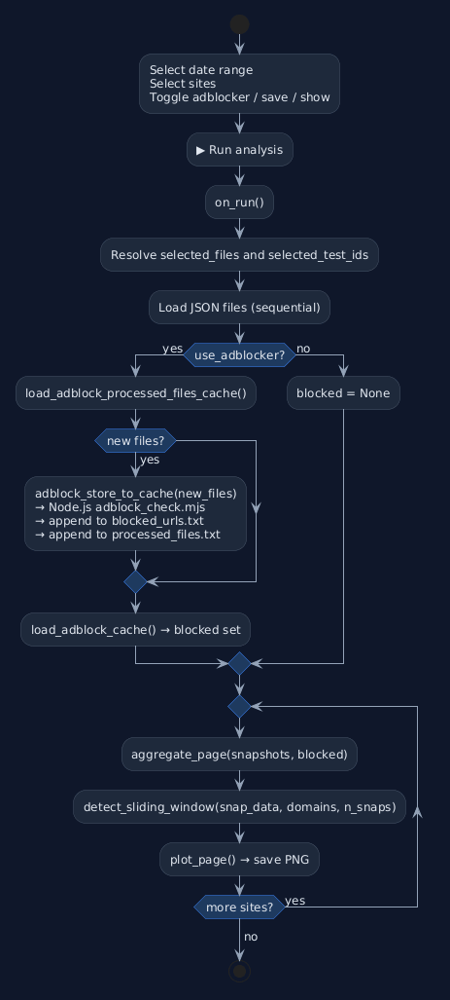
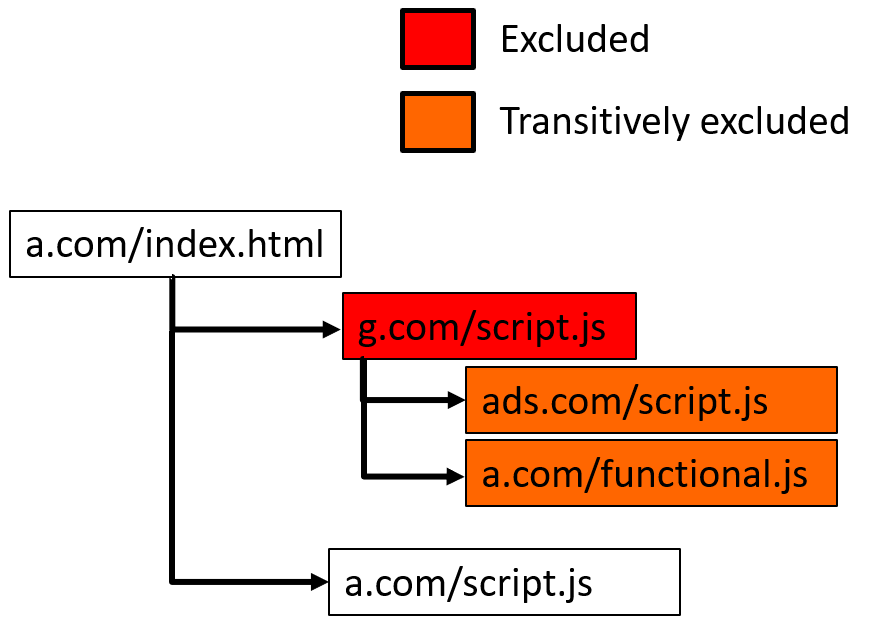
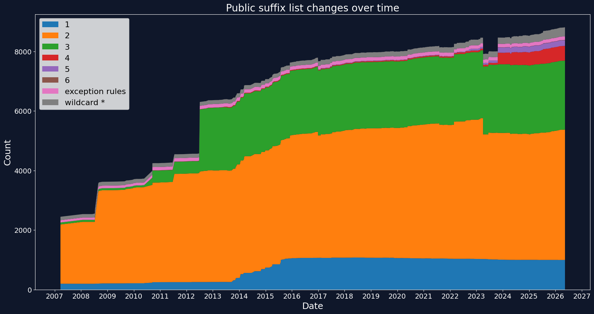
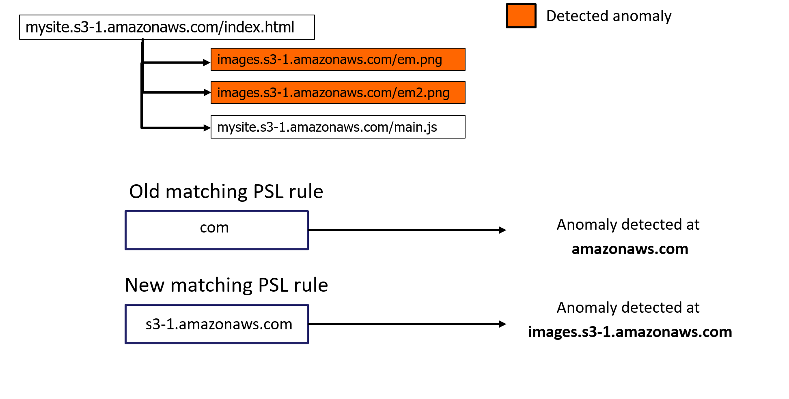

# Developer Manual — eTLD+1 Clustering Analysis Notebook


## Notebook Structure

### Cell 1 — Imports and Configuration

Imports all third-party libraries and defines every global constant. 

Global path constants:

```python
ROOT                             = Path.cwd().parent
DATA_DIR                         = ROOT / "data" / "raw"
DATA_CONFIG                      = ROOT / "data" / "monitoring_config" / "test_id_to_target_host_mapper.json"
ADBLOCK_NODE_SCRIPT              = ROOT / "shared" / "adblocker_ghostery" / "adblock.mjs"
ADBLOCK_CACHE_BLOCKED_URLS_FILE  = ROOT / "shared" / "adblock_cache" / "blocked_urls.txt"
ADBLOCK_CACHE_PROCESSED_FILES_FILE = ROOT / "shared" / "adblock_cache" / "processed_files.txt"
GRAPH_RESULTS_DIR                = Path('./results')
```


Sliding-window parameters:

```python
WINDOW = 144  # history window size in snapshots (144 × 10 min = 24 h)
OUTAGE_CONSEC = 3  # consecutive missing snapshots to declare MISSING_DOMAIN (3 × 10 min = 30 min)
OUTAGE_MIN_PRES = 0.90  # minimum presence ratio in window to be eligible for MISSING_DOMAIN
NEW_DOM_FUTURE_CONSEC = 6  # consecutive present snapshots to declare NEW_DOMAIN (6 × 10 min = 1 h)
MAX_DOMAINS_TO_ANALYZE = 50  # maximum unique eTDL+1 domains per website to analyze 
```


Helper functions defined in Cell 1:

| Function | Purpose                                                        |
|---|----------------------------------------------------------------|
| `get_etld1(url)` | Extract eTLD+1 from a URL using `tldextract` library           |
| `make_cache_key(url, source_url, type_)` | Build MD5 hash of composite key                                |
| `get_composite_key_of_resource(r)` | Build raw composite key string from resource of website        |
| `load_adblock_cache()` | Load blocked MD5 hashes from `blocked_urls.txt` into a set     |
| `load_adblock_processed_files_cache()` | Load processed filenames from `processed_files.txt` into a set |
| `adblock_store_to_cache(files)` | Run `adblock.mjs` for new files and append results to cache    |
| `status_class(code)` | Classify HTTP status code as `4xx`, `5xx`, or `ok`             |

---

### Cell 2 — Config Loading and File Discovery

Discovers all matching JSON files in `data/raw/` and builds `available_dates` (sorted list of ISO date strings) used in UI date range picker.

Reads `test_id_to_target_host_mapper.json` and builds two lookup dictionaries:

```python
testid_to_host : dict[str, str]   # "webapp.http.dynamic.11" → "https://google.com"
host_to_testid : dict[str, str]   # "https://google.com" → "webapp.http.dynamic.11"
```
The user selects sites by human-readable URL (e.g. `https://google.com`) in the widget, but all internal operations use the `test_id` (e.g. `webapp.http.dynamic.11`). This is intentional. The `test_id` is the stable identifier as a result of using YAML monitoring configuration file.

---

### Cell 3 — Aggregation, Detection and Visualisation Functions

Contains three functions:

| Function | Purpose |
|---|---|
| `aggregate_page(snapshots, blocked)` | Filter blocked resources, group by eTLD+1, count presence and errors |
| `detect_sliding_window(snap_data, domains, n_snaps)` | Detect anomalies using sliding window |
| `plot_page(...)` | Render heatmap with anomaly markers, optionally save PNG |

---

### Cell 4 — Widget UI and Run Callback

Instantiates `ipywidgets` controls, registers callbacks, and calls `display()`. The `on_run` callback contains the main execution loop:

1. Resolve selected dates and files from widget state.
2. Load and parse raw data files, grouping snapshots by `target_host` using stable `test_id`.
3. If adblocker is enabled: check cache, run `adblock.mjs` only for new files, load blocked set.
4. For each site: call `aggregate_page()` → `detect_sliding_window()` → `plot_page()`.
5. Print a per-site summary.

The full execution flow of `on_run()` is illustrated in the activity diagram below.

### Activity Diagram



# Adblock Filtering

When monitoring websites, each page could load multiple third-party resources. Such as tracking scripts and advertisements. Those resources are not operated by the monitored organisation and cannot be acted upon by an administrator.
Including them in the analysis adds noise: domains appear and disappear for reasons unrelated to the monitored site's own infrastructure. 
The adblocker step filters these out using EasyList and EasyPrivacy rules before aggregation.

Using the adblocker is optional and can be disabled in the widget.

## Filtering Approach

The adblocker evaluates each resource independently based on its own `URL`, `sourceUrl`, and `type`. This is the **direct blocking** approach. Only resources whose composite key `(url, sourceUrl, type)` is matched by the filter lists are excluded.

An alternative approach is **transitive blocking**: if a resource is blocked, all resources it subsequently loads are also excluded, even if they would not be blocked on their own. This more closely mirrors how browser-based adblockers behave in practice.

The two approaches are illustrated below:

### Direct blocking only
`g.com/script.js` and `ads.com/script.js` are excluded because they match filter rules directly. `a.com/functional.js`, loaded by `g.com/script.js`, is kept because it does not match any rule on its own.


<div style="background-color: white; padding: 10px; display: inline-block; max-width:500px">
  
</div>


### Transitive blocking
`g.com/script.js` is excluded by a filter rule. `ads.com/script.js` and `a.com/functional.js`, both loaded by the excluded `g.com/script.js`, are additionally excluded as transitive dependencies even though they do not match any rule directly.


<div style="background-color: white; padding: 10px; display: inline-block; max-width:500px">
  
</div>


This notebook uses the **direct blocking approach**. This approach aligns with the labeling methodology used in TrackerSift (Amjad et al., IMC 2021 available from: https://arxiv.org/abs/2108.13923), which uses EasyList and EasyPrivacy applied to individual network requests as the test oracle — the ground truth source for distinguishing tracking from functional resources.

---

## Adblock Cache

### Why a Cache is Needed

For real-time or low-volume data, running the Node.js Ghostery engine on each resource as it arrives is not a problem. This notebook however is designed for **batch analysis of historical data**: single run of analysis could cover several weeks of snapshots across dozens of sites. Running `adblock.mjs` against that volume on every analysis run would add several minutes of overhead making iterative exploration of the data impractical.

To avoid this, filtering results are persisted in two append-only plain-text files in `shared/adblock_cache/`. Each file in `data/raw/` is processed by `adblock.mjs` exactly once — on subsequent runs the cache is read directly and `adblock.mjs` is skipped entirely.
> **Note:** Both `blocked_urls.txt` and `processed_files.txt` are pre-populated with data covering the current available dataset
> 

For a detailed description of the file formats see [`shared/README.md`](../../shared/README.md).

### Cache Workflow (inside `on_run`)

```
1. load_adblock_processed_files_cache()  →  set of already processed filenames
2. Compare against selected_files        →  find new files not yet in cache
3. If new files exist:
     adblock_store_to_cache(new_files)
       → collect unique composite keys of resources from each new file 
       → pipe to adblock.mjs via stdin
       → receive blocked keys on stdout
       → write MD5(key) → blocked_urls.txt   (append)
       → write filename  → processed_files.txt (append)
4. load_adblock_cache()  →  set of blocked resources (MD5 hashes)
5. Pass blocked set to aggregate_page()
```

`adblock.mjs` script is only called for files not yet in `processed_files.txt`

### Changing Filter Lists

The pre-populated cache files are tied to the specific filter lists used when they were generated (EasyList + EasyPrivacy). If you need to use different filter lists — for example historical snapshots of the lists, or a custom blocklist — you must:

1. Install requirements see [`shared/README.md`](../../shared/README.md).
1. Update `adblock.mjs` to load the desired lists.
2. Delete both `blocked_urls.txt` and `processed_files.txt` so the cache is rebuilt from scratch on the next run.


## Using eTLD+1 Domain Groups

### Motivation

The notebook tracks third-party dependencies across time by grouping resources under their **eTLD+1** (effective top-level domain plus one label) rather than by full URL. This is a deliberate design choice driven by the unreliability of tracking individual resource URLs over time.

A single third-party provider typically serves resources from a stable registered domain (`analytics.example.com`, `cdn.example.com`) even as the actual file paths, filenames, and query parameters change continuously between deployments. Tracking the full URL would produce a different identity for every cache-busted asset, versioned bundle, or rotating endpoint:

```
# These are the same provider — full URL tracking treats them as unrelated:
https://cdn.example.com/static/js/main.8f3a2c1d.chunk.js
https://cdn.example.com/static/js/main.91b4e7f0.chunk.js?v=2
https://cdn.example.com/v2/bundle/app-20240315.min.js
```

By collapsing all of these to `example.com`, the notebook builds a stable presence signal for each provider across every snapshot in the analysis window, which makes the sliding-window anomaly detection meaningful.

### What eTLD+1 Means

The **public suffix list** defines which parts of a domain name are delegated to registrars and therefore not registerable by end users (`com`, `co.uk`, `github.io`, `s3.amazonaws.com`, etc.). The **eTLD+1** is the public suffix plus the one label to its left — the smallest unit a private entity can actually own and register.

| Full URL | Public Suffix | eTLD+1 |
|---|---|---|
| `https://fonts.googleapis.com/css2?family=Roboto` | `com` | `googleapis.com` |
| `https://static.cdn.example.co.uk/a/b/c.js` | `co.uk` | `example.co.uk` |
| `https://user.github.io/repo/asset.js` | `github.io` | `user.github.io` |

The notebook uses `tldextract` library to group resources by eTLD+1 domains.


### How the Public Suffix List Has Grown Over Time

The PSL has been extended since its creation in 2007. The chart below shows the cumulative number of rules in the list broken down by rule type, tracked across every commit to the repository from 2007 to the present.



The legend categories correspond to the rule structure defined in the PSL specification:

| Legend            | Meaning                                                               |
|-------------------|-----------------------------------------------------------------------|
| `1`               | Simple one-label suffixes (`com`, `net`, `org`, …)                    |
| `2`               | Two-label suffixes (`co.uk`, `com.au`, …)                             |
| `3–6`             | Three to six label suffixes                                           |
| `wildcard *`      | Wildcard rules — every subdomain is a public suffix (`*.kawasaki.jp`) |
| `exception rules` | Exceptions to a wildcard rules                                        |


### What Happens When Using an Outdated PSL

If the PSL is outdated, newly delegated suffixes are not recognised and eTLD+1 extraction falls back to a shorter, incorrect split. Resources that belong to distinct tenants or customers collapse into a single group in the heatmap — anomaly detection fires at the wrong level and the chart becomes uninterpretable.

A concrete example: in 2024, AWS submitted 462 new rules to the PSL, including `s3-1.amazonaws.com`entry . The intent is to give each AWS customer an isolated, registrable domain:

- `mysite.s3-1.amazonaws.com` — one client
- `images.s3-1.amazonaws.com` — another client

They are meant to be treated as distinct eTLD+1 groups. With an old PSL predating this submission, the only relevant suffix rule in PSL is `com`, so the eTLD+1 for every S3 URL — regardless of bucket owner — resolves to `amazonaws.com`. All resources from all customers collapse into one group in the heatmap.

<div style="background-color: white; padding: 10px; display: inline-block;">
  
</div>


In the scenario illustrated above, two resources loaded by `mysite.s3-1.amazonaws.com/index.html`:

- `images.s3-1.amazonaws.com/em.png`
- `images.s3-1.amazonaws.com/em2.png`

are failing (detected anomaly), while `mysite.s3-1.amazonaws.com/main.js` is healthy. With the old PSL rule (`com`), both customers resolve to `amazonaws.com` — the anomaly is reported at that level and it is impossible to tell which bucket or client is affected. With the updated PSL rule (`s3-1.amazonaws.com` as public suffix), the two customers are separated into `images.s3-1.amazonaws.com` and `mysite.s3-1.amazonaws.com`, the anomaly is attributed correctly.


## Data Model

This section describes the five core data structures that flow through the analysis pipeline.

---

### `pages_raw`

Produced by the file loading loop in `on_run`. A `defaultdict(list)` keyed by `target_host` using `testid_to_host()`. Each value is the list of all snapshots collected for that site across the selected date range.

```python
pages_raw: defaultdict[str, list[snapshot]]

{
    'https://google.com': [ snapshot, snapshot, ... ],
    'https://microsoft.com': [ snapshot, snapshot, ... ],
}
```

---

### `snapshots`

One element from `pages_raw[target_host]`. A list of snapshot dicts, one per measurement collected for a given site. Used by `aggregate_page()` and `plot_page()` for x-axis timestamp labels.

```python
snapshots: list[dict]
```

Each snapshot dict has the following structure:

```python
{
    'timestamp': str,        # ISO 8601 string — from Meta.Timestamp 
    'test_id':   str,        # stable monitoring identifier — e.g. "webapp.http.dynamic.11"
    'resources': [
        {
            'url':    str,   # full resource URL — only entries starting with "http" are kept
            'status': str,   # HTTP status code as string — e.g. "200", "404"
            'source': str,   # initiator of this resource
            'type':   str,   # resource type — "script", "image", "stylesheet", etc.
        },...
    ]
}
```

> **Note:** `aggregate_page()` mutates `snap['resources']` when the adblocker is enabled. Blocked entries are removed from the list before aggregation.

---

### `snap_data`

Output of `aggregate_page()`. A list of per-snapshot dicts, parallel to `snapshots` (index `i` in `snap_data` corresponds to index `i` in `snapshots`). Each dict maps an eTLD+1 domain to its presence and error counts observed in that single snapshot.

```python
snap_data: list[dict[str, dict]]
```

Each entry has the following structure:

```python
# snap_data[i]  — counts for snapshot i
{
    'google-analytics.com': {'present': 1, '4xx': 0, '5xx': 0},
    'cdn.example.co.uk':    {'present': 0, '4xx': 1, '5xx': 0},
}
```

Field semantics:

| Field | Type | Meaning |
|---|---|---|
| `present` | `int` (0 or 1) | `1` if at least one resource from this domain was observed in the snapshot, `0` otherwise |
| `4xx` | `int` | Count of resources from this domain that returned a 4xx status in this snapshot |
| `5xx` | `int` | Count of resources from this domain that returned a 5xx status in this snapshot |

A domain key is absent from a given snapshot dict if no resource from that domain appeared in that snapshot at all. Code that reads `snap_data` must guard with `dom in s` before accessing `s[dom]`.

---

### `domains`

Output of `aggregate_page()`. A list of eTLD+1 strings representing every third-party domain observed across all snapshots for the site. Sorted in descending order of total presence count (domains that appeared in the most snapshots come first). Truncated to `MAX_DOMAINS_TO_ANALYZE` (default: 50) before being passed to `detect_sliding_window()` and `plot_page()`.

```python
domains: list[str]

# Example:
['googleapis.com', 'gstatic.com', 'google-analytics.com', 'doubleclick.net', …]
```

---

### `presence`

Output of `detect_sliding_window()`. A dict mapping each domain to a `numpy.ndarray` of length `n_snaps` (total snapshot count). Each element is a `float32` value of `1.0` if the domain was present in that snapshot, `0.0` otherwise. Used directly by `plot_page()` to build the heatmap matrix.

```python
presence: dict[str, np.ndarray]

# Example:
{
    'googleapis.com':       np.array([1., 1., 1., 0., 1., ...]),
    'google-analytics.com': np.array([0., 1., 1., 1., 1., ...]),
}
```

The companion arrays `err_4xx` and `err_5xx` follow the same structure, with integer-valued error counts per snapshot rather than binary presence flags:

```python
err_4xx: dict[str, np.ndarray]   # 4xx error count per snapshot
err_5xx: dict[str, np.ndarray]   # 5xx error count per snapshot
```

---

### `anomalies`

Output of `detect_sliding_window()`. A `defaultdict(list)` mapping each domain to a list of detected anomaly events. Each event is a `(snapshot_index, anomaly_type)` tuple. Only domains with at least one anomaly appear as keys.

```python
anomalies: defaultdict[str, list[tuple[int, str]]]

# Example:
{
    'googleapis.com': [
        (187, 'MISSING_DOMAIN'),
        (521, 'MISSING_DOMAIN'),
    ],
    'doubleclick.net': [
        (302, 'ERROR_4XX'),
    ],
    'new-tracker.io': [
        (144, 'NEW_DOMAIN'),
    ],
}
```

`snapshot_index` is a zero-based index into `snapshots` / `presence`. `anomaly_type` is one of four string values:

| Colour | Anomaly | Meaning |
|---|---|---|
| 🔴 Red | `MISSING_DOMAIN` | Domain was present in ≥ 90 % of the last 24 h, then gone for ≥ 30 consecutive minutes |
| 🟢 Green | `NEW_DOMAIN` | Domain was completely absent for 24 h, then appeared consistently for ≥ 1 h |
| 🟠 Orange | `ERROR_4XX` | 4xx error count exceeded the 24-hour rolling median |
| 🟣 Purple | `ERROR_5XX` | 5xx error count exceeded the 24-hour rolling median |

---


## Known Limitations

**Performance on large datasets.** All snapshots for all selected sites are loaded into memory before aggregation. Selecting multiple websites and wide date range can result to a high RAM consumption and long analysis execution.

**Single-threaded file loading.** The `on_run` loop loads files sequentially. On large datasets this is the dominant bottleneck (~90s for 27 files × 250 MB). 

---


