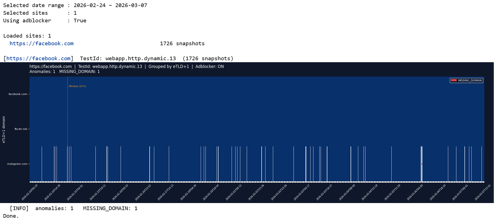
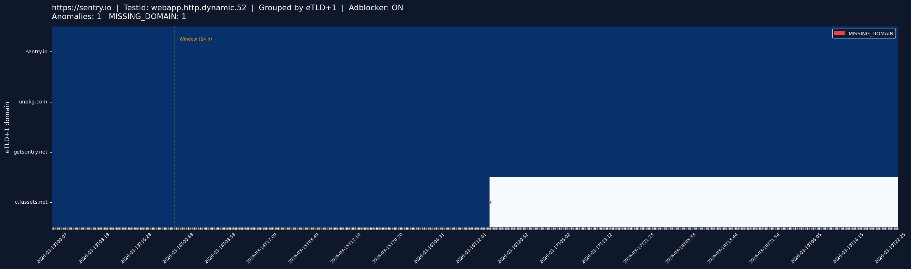
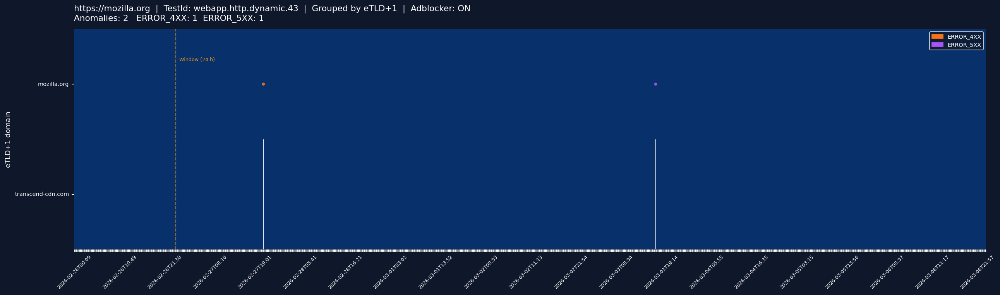
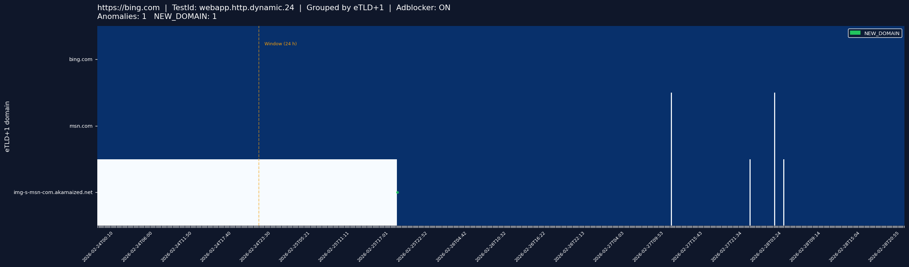

# Usage Manual — eTLD+1 Clustering Analysis Notebook

## Introduction


This notebook analyses **resource domains** loaded by actively monitored web pages.  
The notebook groups resources by their **eTLD+1 domain** (e.g. `cdn.example.co.uk` -> `example.co.uk`) and then detects anomalies over time using a sliding-window.


### Main Features
- Filters ad/tracker resources using the Ghostery adblocker (optional) to reduce noise from advertising domains.
- Groups all loaded URLs by eTLD+1 and computes per-domain presence and error statistics across all snapshots.
- Detects four anomaly types using a sliding history window:
  - **MISSING_DOMAIN** — a domain that was reliably present suddenly stops appearing.
  - **NEW_DOMAIN** — a domain that was never seen before starts appearing consistently.
  - **ERROR_4XX** — HTTP 4xx error count exceeds the local historical median baseline.
  - **ERROR_5XX** — HTTP 5xx error count exceeds the local historical median baseline.
- Renders a heatmap for each monitored site with anomaly markers.
- Optionally saves the charts as PNG files to the `results/` directory.

---

## Input Data
For download instructions see [`data/README.md`](../../data/README.md).

---

## Running the Notebook

### Opening the Notebook

1. From the project root, launch Jupyter:
   ```bash
   jupyter notebook
   ```
2. Navigate to `analysis_etl_plus_one_clustering/` and open `analysis_etdl_plus_one_clustering.ipynb`.

### Cell Execution Order

The notebook must be run **top to bottom** in order:

| Cell | Purpose                                                                                        |
|---|------------------------------------------------------------------------------------------------|
| 1 | Imports, global configuration (paths, window parameters, colours) and helper methods           |
| 2 | Loads `data_config.json` and discovers available data files                                    |
| 3 | Defines helper and analysis functions (`aggregate_page`, `detect_sliding_window`, `plot_page`) |
| 4 | Renders the interactive widget UI and registers button callbacks                               |


### Configuring Input Parameters

All constants are in **Cell 1**, clearly marked in the `# Sliding window parameters` block:

```python
WINDOW                  = 144   # history window size in snapshots (144 × 10 min = 24 h)
OUTAGE_CONSEC           = 3     # consecutive missing snapshots to declare MISSING_DOMAIN (3 × 10 min = 30 min)
OUTAGE_MIN_PRES         = 0.90  # minimum presence ratio in window to be eligible for MISSING_DOMAIN
NEW_DOM_FUTURE_CONSEC   = 6     # consecutive present snapshots to declare NEW_DOMAIN (6 × 10 min = 1 h)
MAX_DOMAINS_TO_ANALYZE  = 50    # maximum unique eTDL+1 domains per website to analyze
```

Edit these values before running the notebook if you want different sensitivity. 

If your monitoring interval differs from 10 minutes, scale all snapshot-count parameters accordingly. For example, with a 5-minute interval, `WINDOW = 288` still represents 24 hours.

---

## Using the Interactive UI

After running all four cells, an interactive control panel appears at the bottom of cell 4.


### Date Range Selection

A horizontal slider labelled **Date range** lets you select date range of monitored data. 
The range is inclusive on both ends selecting **2026-02-24** to **2026-02-25** covers all measurements from **2026-02-24 00:00** through **2026-02-25 23:59**.

### Site Selection

The **Sites** list shows all monitored URLs from the config. You can:
- Hold **Shift** and click to select a contiguous range.
- Hold **Ctrl / Cmd** and click to toggle individual entries.
- Click **Select all** to reselect everything.
- Click **Clear selection** to deselect everything.

### Adblocker Toggle

The **Use adblocker to filter ads** optional checkbox runs every resource URL through the Ghostery filter lists before aggregation. When enabled, known advertising and tracker domains are excluded from the heatmap. 

### Output Options

- **Show graphs in console** — renders each heatmap inline in the notebook output area.
- **Save graphs to /results** — writes a PNG file per site to `analysis_etl_plus_one_clustering/results/`. File names follow the pattern `<test_id>.<host_slug>.png`.

### Running the Analysis

Click **Run analysis**. Output should appear below the controls for example:




A site is **skipped** if it has fewer snapshots than `WINDOW` (default: 144). You need at least 145 snapshots of data for a site to appear in the results.

---

## Interpreting the Results

### Heatmap

- Each row is an unique eTLD+1 domain. 
- Each column is one monitoring snapshot ordered chronologically left to right.
- **blue cell** means the domain was present in that snapshot 
- **white cell** means it was absent. 
- vertical line marks the `WINDOW` boundary


A vertical line marks the initial `MOVING WINDOW` boundary. Everything to its left is historical context used to build the baseline. Anomaly detection only fires for columns to its right, as the window slides in time.
### Anomaly Markers

Coloured dots are overlaid on the heatmap cells where anomalies were detected:

| Colour | Anomaly | Meaning |
|---|---|---|
| 🔴 Red | `MISSING_DOMAIN` | Domain was present in ≥ 90 % of the last 24 h, then gone for ≥ 30 consecutive minutes |
| 🟢 Green | `NEW_DOMAIN` | Domain was completely absent for 24 h, then appeared consistently for ≥ 1 h |
| 🟠 Orange | `ERROR_4XX` | 4xx error count exceeded the 24-hour rolling median |
| 🟣 Purple | `ERROR_5XX` | 5xx error count exceeded the 24-hour rolling median |

All constants used for anomaly detections can be edited in `cell 1`
### Identifying Outages

Red markers highlight domains that suddenly disappear despite being consistently present beforehand.
In the example below, the red anomaly marker show the point at which requests to the eTLD+1 domain `ctfassets.net` stopped appearing.



### Identifying Elevated Error Rates (ERROR_5XX and ERROR_4XX)
Orange and purple markers indicate time periods where HTTP error counts exceeded their normal behaviour.
The image below shows isolated `ERROR_4XX` and `ERROR_5XX` anomalies for the eTLD+1 domain `mozilla.org`. It also shows a temporary outage of the eTLD+1 domain `transcend-cdn.com`. However, this outage was not flagged as a `MISSING_DOMAIN` anomaly because it was observed in only a single snapshot, while the configured detection threshold requires a domain to be absent for at least 3 consecutive snapshots (20 minutes).




### Identifying New Third-Party Dependencies

Green markers indicate domains that were previously absent but suddenly begin appearing in requests.
In the example below, the green marker indicates a `NEW_DOMAIN` anomaly for the eTLD+1 domain `img-s-msn-com-akamaized.net`. Similar to the previous example, the heatmap also shows temporary outages of two domains which were not flagged because they were present only for a single snapshot interval.





