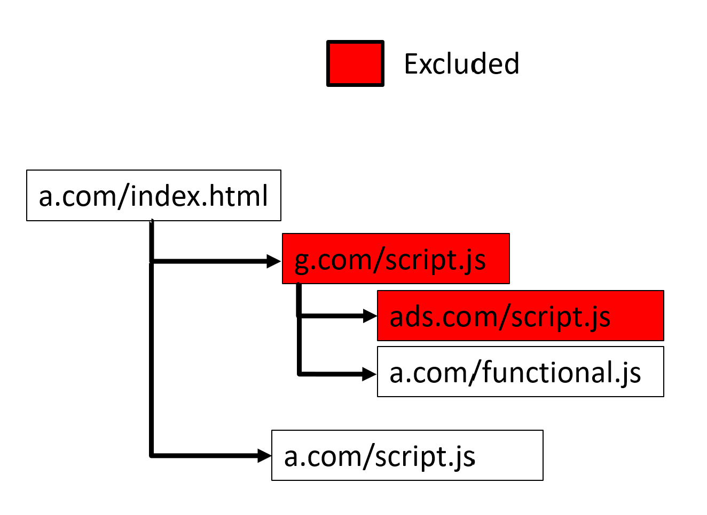
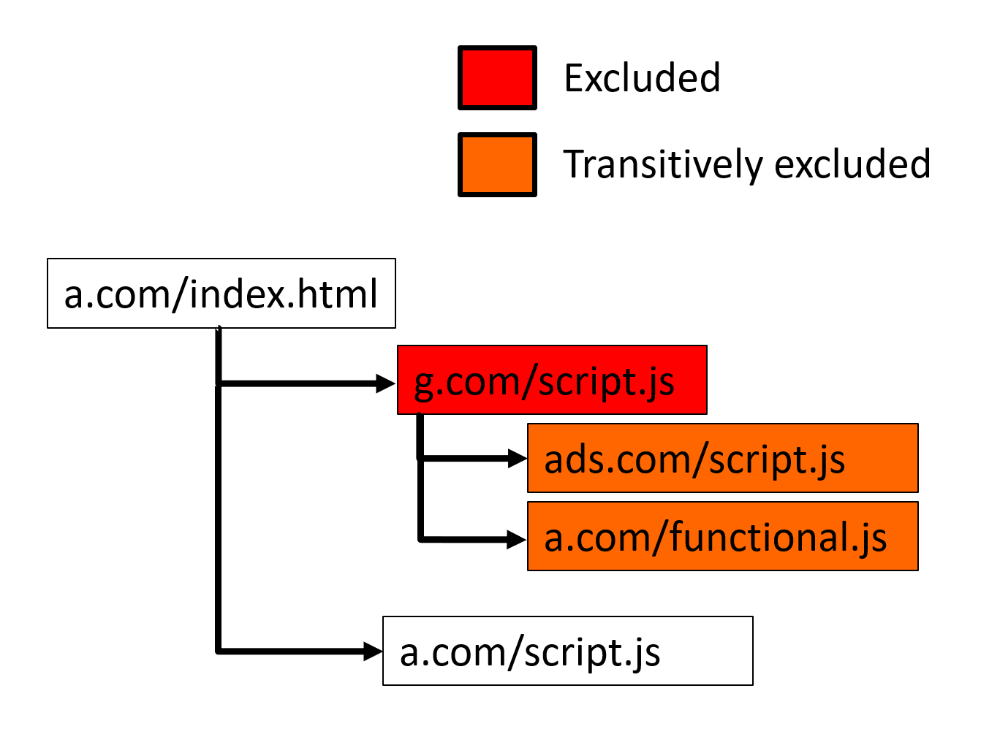
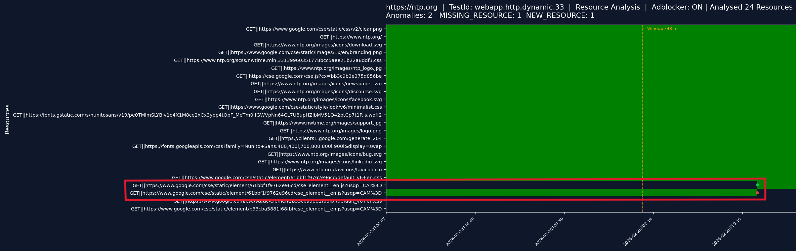
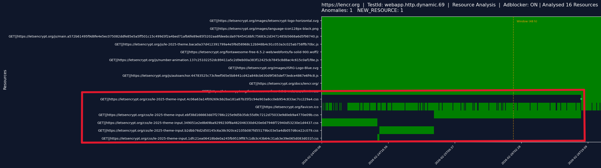
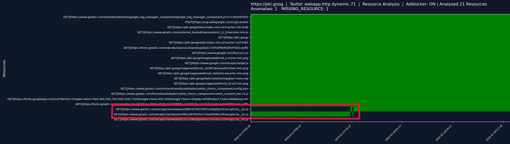
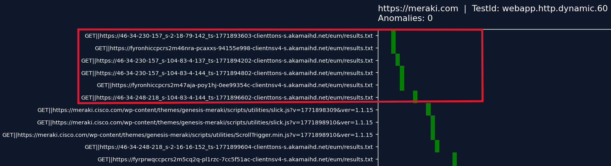
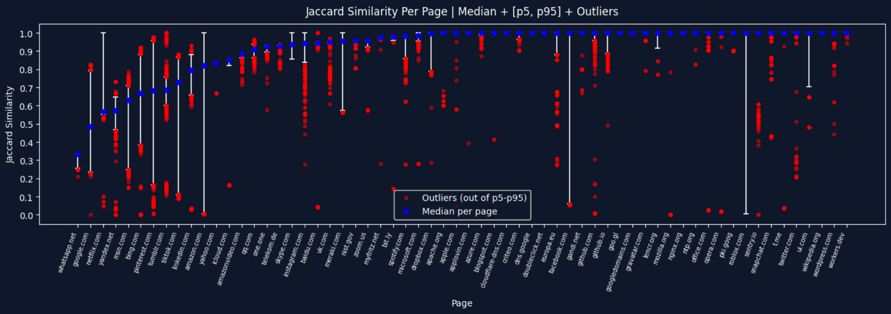
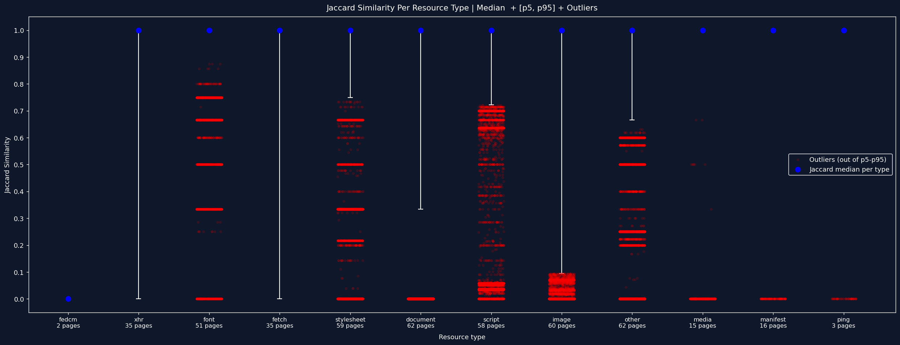

# Developer Manual — Single Resources Analysis Notebook

# Section Menu

- [Developer Manual — Single Resources Analysis Notebook](#developer-manual--single-resources-analysis-notebook)
  - [Notebook Structure](#notebook-structure)
    - [Cell 1 — Imports and Configuration](#cell-1--imports-and-configuration)
    - [Cell 2 — Config Loading and File Discovery](#cell-2--config-loading-and-file-discovery)
    - [Cell 3 — Aggregation, Detection and Visualisation Functions](#cell-3--aggregation-detection-and-visualisation-functions)
    - [Cell 4 — Widget UI and Run Callback](#cell-4--widget-ui-and-run-callback)
    - [Activity Diagram](#activity-diagram)
- [Adblock Filtering](#adblock-filtering)
  - [Filtering Approach](#filtering-approach)
    - [Direct blocking only](#direct-blocking-only)
    - [Transitive blocking](#transitive-blocking)
  - [Adblock Cache](#adblock-cache)
    - [Why a Cache is Needed](#why-a-cache-is-needed)
    - [Cache Workflow (inside `on_run`)](#cache-workflow-inside-on_run)
    - [Changing Filter Lists](#changing-filter-lists)
- [Dynamic Behavior of Monitored Web Resources](#dynamic-behavior-of-monitored-web-resources)
  - [Observed Types of Resource Changes](#observed-types-of-resource-changes)
    - [1. Query Parameter Change](#1-query-parameter-change)
    - [2. Filename Change](#2-filename-change)
    - [3. Path Change](#3-path-change)
    - [4. Domain Change](#4-domain-change)
  - [Analysis of resource stability](#analysis-of-resource-stability)
    - [Stability of resource types in time](#stability-of-resource-types-in-time)
    - [The document outliers](#the-document-outliers)
  - [Implications](#implications)
    - [Adjusting the detection sensitivity](#adjusting-the-detection-sensitivity)
    - [Alternative approach — eTLD+1 grouping](#alternative-approach--etld1-grouping)
    - [Future directions](#future-directions)
- [Data Model](#data-model)
- [Known Limitations](#known-limitations)

## Notebook Structure

### Cell 1 — Imports and Configuration

Imports all third-party libraries and defines every global constant. 

Global path constants:

```python
ROOT                             = Path.cwd().parent
DATA_DIR                         = ROOT / "data" / "raw"
DATA_CONFIG                      = ROOT / "data" / "monitoring_config" / "test_id_to_target_host_mapper.json"
ADBLOCK_NODE_SCRIPT              = ROOT / "shared" / "adblocker_ghostery" / "adblock.mjs"
ADBLOCK_CACHE_BLOCKED_URLS_FILE  = ROOT / "shared" / "adblock_cache" / "blocked_urls.txt"
ADBLOCK_CACHE_PROCESSED_FILES_FILE = ROOT / "shared" / "adblock_cache" / "processed_files.txt"
GRAPH_RESULTS_DIR                = Path('./results')
```


Sliding-window parameters:

```python
WINDOW = 288  # history window size in snapshots (288 × 10 min = 48 h)
OUTAGE_CONSEC = 3  # consecutive missing snapshots to declare MISSING_RESOURCE (3 × 10 min = 30 min)
OUTAGE_MIN_PRES = 0.99  # minimum presence ratio in window to be eligible for MISSING_RESOURCE
NEW_RES_FUTURE_CONSEC = 6  # consecutive present snapshots to declare NEW_RESOURCE (6 × 10 min = 1 h)
MAX_RESOURCES_TO_ANALYZE = 100  # maximum unique resources per website to analyze 
```

Visualisation Parameters:

```python
RESOURCE_URL_HEAD_SIZE = 200 # Maximum number of characters preserved from the beginning of a URL.
RESOURCE_URL_TAIL_SIZE = 12  # Number of characters preserved from the end of a truncated URL
```


Helper functions defined in Cell 1:

| Function | Purpose                                                        |
|---|----------------------------------------------------------------|
| `make_cache_key(url, source_url, type_)` | Build MD5 hash of composite key                                |
| `get_composite_key_of_resource(r)` | Build raw composite key string from resource of website        |
| `load_adblock_cache()` | Load blocked MD5 hashes from `blocked_urls.txt` into a set     |
| `load_adblock_processed_files_cache()` | Load processed filenames from `processed_files.txt` into a set |
| `adblock_store_to_cache(files)` | Run `adblock.mjs` for new files and append results to cache    |
| `status_class(code)` | Classify HTTP status code as `4xx`, `5xx`, or `ok`             |

---

### Cell 2 — Config Loading and File Discovery

Discovers all matching JSON files in `data/raw/` and builds `available_dates` (sorted list of ISO date strings) used in UI date range picker.

Reads `test_id_to_target_host_mapper.json` and builds two lookup dictionaries:

```python
testid_to_host : dict[str, str]   # "webapp.http.dynamic.11" → "https://google.com"
host_to_testid : dict[str, str]   # "https://google.com" → "webapp.http.dynamic.11"
```
The user selects sites by human-readable URL (e.g. `https://google.com`) in the widget, but all internal operations use the `test_id` (e.g. `webapp.http.dynamic.11`). This is intentional. The `test_id` is the stable identifier as a result of using YAML monitoring configuration file.

---

### Cell 3 — Aggregation, Detection and Visualisation Functions

Contains three functions:

| Function                                               | Purpose                                                                   |
|--------------------------------------------------------|---------------------------------------------------------------------------|
| `aggregate_page(snapshots, blocked)`                   | Filter blocked resources, group by `resource_id`, count presence and errors |
| `detect_sliding_window(snap_data, resources, n_snaps)` | Detect anomalies using sliding window                                     |
| `plot_page(...)`                                       | Render heatmap with anomaly markers, optionally save PNG                  |

> **Note:** `resource_id` is the identifier of resource in the form `<METHOD>||<URL>`.
---

### Cell 4 — Widget UI and Run Callback

Instantiates `ipywidgets` controls, registers callbacks, and calls `display()`. The `on_run` callback contains the main execution loop:

1. Resolve selected dates and files from widget state.
2. Load and parse raw data files, grouping snapshots by `target_host` using stable `test_id`.
3. If adblocker is enabled: check cache, run `adblock.mjs` only for new files, load blocked set.
4. For each site: call `aggregate_page()` → `detect_sliding_window()` → `plot_page()`.
5. Print a per-site summary.

The full execution flow of `on_run()` is illustrated in the activity diagram below.

### Activity Diagram


# Adblock Filtering

When monitoring websites, each page could load multiple third-party resources. Such as tracking scripts and advertisements. Those resources are not operated by the monitored organisation and cannot be acted upon by an administrator.
Including them in the analysis adds noise: domains appear and disappear for reasons unrelated to the monitored site's own infrastructure. 
The adblocker step filters these out using EasyList and EasyPrivacy rules before aggregation.

Using the adblocker is optional and can be disabled in the widget.

## Filtering Approach

The adblocker evaluates each resource independently based on its own `URL`, `sourceUrl`, and `type`. This is the **direct blocking** approach. Only resources whose composite key `(url, sourceUrl, type)` is matched by the filter lists are excluded.

An alternative approach is **transitive blocking**: if a resource is blocked, all resources it subsequently loads are also excluded, even if they would not be blocked on their own. This more closely mirrors how browser-based adblockers behave in practice.

The two approaches are illustrated below:

### Direct blocking only
`g.com/script.js` and `ads.com/script.js` are excluded because they match filter rules directly. `a.com/functional.js`, loaded by `g.com/script.js`, is kept because it does not match any rule on its own.


<div align="center">
  
</div>

### Transitive blocking
`g.com/script.js` is excluded by a filter rule. `ads.com/script.js` and `a.com/functional.js`, both loaded by the excluded `g.com/script.js`, are additionally excluded as transitive dependencies even though they do not match any rule directly.


<div align="center">
  
</div>

This notebook uses the **direct blocking approach**. This approach aligns with the labeling methodology used in TrackerSift (Amjad et al., IMC 2021 available from: https://arxiv.org/abs/2108.13923), which uses EasyList and EasyPrivacy applied to individual network requests as the test oracle — the ground truth source for distinguishing tracking from functional resources.

---

## Adblock Cache

### Why a Cache is Needed

For real-time or low-volume data, running the Node.js Ghostery engine on each resource as it arrives is not a problem. This notebook however is designed for **batch analysis of historical data**: single run of analysis could cover several weeks of snapshots across dozens of sites. Running `adblock.mjs` against that volume on every analysis run would add several minutes of overhead making iterative exploration of the data impractical.

To avoid this, filtering results are persisted in two append-only plain-text files in `shared/adblock_cache/`. Each file in `data/raw/` is processed by `adblock.mjs` exactly once — on subsequent runs the cache is read directly and `adblock.mjs` is skipped entirely.
> **Note:** Both `blocked_urls.txt` and `processed_files.txt` are pre-populated with data covering the current available dataset
> 

For a detailed description of the file formats see [`shared/README.md`](../../shared/README.md).

### Cache Workflow (inside `on_run`)

```
1. load_adblock_processed_files_cache()  →  set of already processed filenames
2. Compare against selected_files        →  find new files not yet in cache
3. If new files exist:
     adblock_store_to_cache(new_files)
       → collect unique composite keys of resources from each new file 
       → pipe to adblock.mjs via stdin
       → receive blocked keys on stdout
       → write MD5(key) → blocked_urls.txt   (append)
       → write filename  → processed_files.txt (append)
4. load_adblock_cache()  →  set of blocked resources (MD5 hashes)
5. Pass blocked set to aggregate_page()
```

`adblock.mjs` script is only called for files not yet in `processed_files.txt`

### Changing Filter Lists

The pre-populated cache files are tied to the specific filter lists used when they were generated (EasyList + EasyPrivacy). If you need to use different filter lists — for example historical snapshots of the lists, or a custom blocklist — you must:

1. Install requirements see [`shared/README.md`](../../shared/README.md).
1. Update `adblock.mjs` to load the desired lists.
2. Delete both `blocked_urls.txt` and `processed_files.txt` so the cache is rebuilt from scratch on the next run.


# Dynamic Behavior of Monitored Web Resources

Dynamic behavior refers to a page's tendency to change its set of resources (adding, removing, or replacing them).
In this section, datasets from the `webapp.http_dynamic.single_page.tranco.*` collection covering the period from **2026-02-24** to **2026-03-09** were analyzed with the adblocker option on.

## Observed Types of Resource Changes

When a resource is swapped (i.e. one URL disappears and another takes its place), the change can occur at different levels of the URL structure. Four distinct categories of resource change were observed. Each category reflects a different part of the URL that changes.

### 1. Query Parameter Change

The resource is served from the same path and filename, but one or more query parameters differ (e.g. version identifier, or a tracking parameter). The underlying asset is usually the same or near-identical; only the request URL differs.

| Status | Resource |
|---|---|
| MISSING | google.com/cse/static/element/61bbf1f9762e96cd/cse_element_en.js?usqp=**CAI%3D** |
| NEW | google.com/cse/static/element/61bbf1f9762e96cd/cse_element_en.js?usqp=**CAM%3D** |

As shown in the image below, this resource was swapped within a single snapshot transition: present in one snapshot, missing in the next, with a new entry appearing at the same time that differs only in the query parameter value.



### 2. Filename Change

The resource is served from the same domain and directory path, but the filename itself changes.


| Resource (filename changes)                                                        | Presence duration |
|-------------------------------------------------------------------------------------------------------|---|
| letsencrypt.org/css/le-2025-theme-input.**4c06a63a14f09269cbb2ba181a87b35f2c94e903a8cc0eb954c833ac7cc229a4**.css | present continuously over the chart period |
| letsencrypt.org/css/le-2025-theme-input.**ebf38d166663dd7f2786c225e9d5b35dc55d9c7212d75033e9d0eb9a4770e09b**.css | 36h 50min |
| letsencrypt.org/css/le-2025-theme-input.**349051e2e8b69ba9299230f8a462046330d420e0d7946f72940d53230e1d4437**.css | 14h |
| letsencrypt.org/css/le-2025-theme-input.**b2dbb76d2d50145c6a38c920ce2105b087fd55179bc03e5a4db057d6ce22c079**.css | 13h 30min |
| letsencrypt.org/css/le-2025-theme-input.**1dfc21ea06418bde0a245fb9519ff87c1db3c43b64c31ab3e39e065d083d031f**.css | 20min |




### 3. Path Change

The resource is served from the same domain, but the directory path to the resource changes (e.g. the asset moves to a different folder or a restructured CDN path). The filename may stay the same or change as well, but the defining characteristic here is the change in path structure.

| Status | Resource                                                                     |
|---|------------------------------------------------------------------------------|
| MISSING | gstatic.com/recaptcha/releases/**AWtrSI7IAmTAfV1rzWqEqz54**/recaptcha_en.js  |
| NEW | gstatic.com/recaptcha/releases/**P8cyHPrXODVY7ASorEhMUv3P**/recaptcha_en.js |

Domain (`www.gstatic.com`) and filename (`recaptcha_en.js`) stay constant; only the segment of the path changes.



### 4. Domain Change

The resource is served from an entirely different domain than before (e.g. moving subdomain to another). 

| Resources present in 1. snapshot                                                          |
|-------------------------------------------------------------------------------------------|
| `**46-34-230-157_s-2-18-79-142_ts-1771893603**-clienttons-s.akamaihd.net/eum/results.txt  |
| `**fyronhiccpcrs2m46nra-pcaxxs-94155e998**-clientnsv4-s.akamaihd.net/eum/results.txt      |

| Resources present In 2. snapshot                                                         |
|------------------------------------------------------------------------------------------|
| `**46-34-230-157_s-104-83-4-137_ts-1771894202**-clienttons-s.akamaihd.net/eum/results.txt |

| Resources present In 3. snapshot                                                          |
|-------------------------------------------------------------------------------------------|
| `**46-34-230-157_s-104-83-4-144_ts-1771894802**-clienttons-s.akamaihd.net/eum/results.txt |
| `**fyronhiccpcrs2m47aja-poy1hj-0ee99354c**-clientnsv4-s.akamaihd.net/eum/results.txt      |

| Resources present In 4. snapshot                                                          |
|-------------------------------------------------------------------------------------------|
| `**46-34-248-218_s-104-83-4-144_ts-1771896602**-clienttons-s.akamaihd.net/eum/results.txt |

Here, the 3LD is dynamically generated for each snapshot and appears to contain a timestamp, while the 2LD (`akamaihd.net`) and the resource path (`/eum/results.txt`) remain constant.


> **Note:** This specific graph was generated with custom resource sorting. The final notebook sorts resources based on their overall presence across the entire selected date range.
## Analysis of resource stability 

In this section, datasets from the `webapp.http_dynamic.single_page.tranco.*` collection covering the period from **2026-02-24** to **2026-03-09** were analyzed with the adblocker option on.


For each page, for every pair of consecutive snapshots, Jaccard similarity is calculated:

$$ J(A_i, A_{i+1}) = \frac{|A_i \cap A_{i+1}|}{|A_i \cup A_{i+1}|} $$

where $A_i$ is the set of resources `<method>||<url>` from snapshot $i$, and $A_{i+1}$ is the set of resources `<method>||<url>` from snapshot $i+1$.

For example, in two consecutive snapshots, if out of 10 resources 5 are replaced (old ones removed, new ones added), the Jaccard value is $5/15 = 1/3$. With no change between two consecutive snapshots (same resources present in both), the Jaccard value is $1$, representing a stable page.

The graph below shows the Jaccard similarity median, the [p5, p95] percentile boundary, and outliers.




From the graph we can observe the following:

**`Stable`** — 6 out of 62 pages: median = p5 = p95 = 1.0, no outliers. The same resources were present in every snapshot throughout the 14 days of monitoring.

**`Stable with outliers`** — 18 out of 62 pages: median = p5 = p95 = 1.0, but rare exceptions occur as outliers. The page is stable within the [p5, p95] range, with only occasional resource changes.

**`Unstable`** — 36 out of 62 pages: varying degree of median ,p5 and p95. 

**`Stably unstable`** — 2 out of 62 pages (`myfritz.net` and `yahoo.com`): always changing, but always by the same magnitude (median = p5 = p95 < 1). These pages contain a stable core set of resources plus one dynamic resource of the `Query Parameter Change` type that differs in every snapshot.

### Stability of resource types in time

Different resource types within a page can exhibit different levels of stability. For example, the resource type `document`, representing an HTML file, could intuitively be expected to be stable. However, the analysis indicates otherwise.

This type classification comes from the Puppeteer library (used for visiting pages during monitoring). It is important to note that it is *"Resource type as it was perceived by the rendering engine"*, meaning the value is **not** derived from the `Content-Type` header of the resource.

The full set of possible values is defined at: [Chrome DevTools Protocol – Network.ResourceType](https://chromedevtools.github.io/devtools-protocol/1-3/Network/#type-ResourceType)

The analysed dataset contains **12 out of the 19 possible types**.


Unlike the previous per-page analysis — where a single Jaccard value was computed per consecutive snapshot pair across all resources of a page — here the resources within each snapshot pair are **split by type first**. For each page and each pair of consecutive snapshots, a separate Jaccard similarity is computed for every resource type present in either snapshot.

These per-type Jaccard values are then **combined across all pages and all snapshot pairs** into a single list per type. The median, [p5, p95] percentile interval, and outliers shown in the graph are computed from this combined list. 



#### Observations
The 12 observed types can be grouped into three categories:

**`Stable with outliers`** — 4 out of 12 types — median = p5 = p95 = 1.0 with outliers.
`font` (51 pages), `manifest` (16 pages), `media` (15 pages), `ping` (3 pages).

**`Unstable with stable median`** — 7 out of 12 types — median = 1.0, but [p5, p95] and outliers reveal meaningful variability:
`stylesheet`, `fetch`, `xhr`, `document`, `script`, `image`, `other`.

**`Always unstable`** — 1 out of 12 types — median = p5 = p95 = 0: 
`fedcm` (2 pages)

#### The `document` outliers

As visible in the graph, the `document` resource type contains several outliers reaching a Jaccard value of 0.
A closer inspection shows that these cases are caused by pages such as `yandex.net`, `yahoo.com`, and `bing.com`. These pages perform navigation redirects, resulting in a different HTML resource being loaded in each snapshot. In particular, the redirected document belongs to the `Query Parameter Change` category, where a dynamic parameter changes on every visit.


## Implications

The analysis tracks resources by their exact `<method>||<url>` composite key. This identifier has a structural consequence: when a resource changes its URL, even if the underlying asset is functionally identical, the monitoring system treats it as the disappearance of one resource and the appearance of another, as documented in the *Observed Types of Resource Changes* section.


### Adjusting the detection sensitivity

The sensitivity of the current approach can be adjusted without changing the underlying tracking strategy:

- **Widening the sliding window** — increasing `WINDOW` (default: 288 snapshots = 48 h) gives the detector a longer memory. Combination with `OUTAGE_MIN_PRES` (minimal presence ratio to be eligible for MISSING_RESOURCE) will reduce false `MISSING_RESOURCE` alerts caused by resources that temporarily disappear and later reappear under a different URL.


### Alternative approach — eTLD+1 grouping

Another approach is to track resources at the **eTLD+1 domain level** rather than the full URL level. Instead of asking *"is this exact URL present?"*, the question becomes *"is any resource from this domain present?"*. Under this model, a `Query Parameter Change` or `Path Change` does not register as a `MISSING_RESOURCE` — the domain remains present regardless of which specific URL is loaded.

This is the approach implemented in the `analysis_etl_plus_one_clustering` notebook, which groups resources by eTLD+1 domain and applies the same sliding-window anomaly detection.

### Future directions

The two approaches represent different trade-offs between precision and robustness:

- **URL-level tracking** captures fine-grained changes (e.g. a specific script version being swapped) but is noisy in the presence of dynamic URLs.
- **eTLD+1-level tracking** is robust to URL change but loses the ability to distinguish between different resources served from the same domain.

A possible extension is to **associate resources with different URLs that represent the same logical asset**. Such an approach could preserve the information of URL-level tracking while reducing instability caused by dynamic URL changes.

---

# Data Model

### `pages_raw`

Produced by the file loading loop in `on_run`. A `defaultdict(list)` keyed by `target_host` using `testid_to_host()`. Each value is the list of all snapshots collected for that site across the selected date range.

```python
pages_raw: defaultdict[str, list[snapshot]]

{
    'https://google.com': [ snapshot, snapshot, ... ],
    'https://microsoft.com': [ snapshot, snapshot, ... ],
}
```

---

### `snapshots`

One element from `pages_raw[target_host]`. A list of snapshot dicts, one per measurement collected for a given site. Used by `aggregate_page()` and `plot_page()` for x-axis timestamp labels.

```python
snapshots: list[dict]
```

Each snapshot dict has the following structure:

```python
{
    'timestamp': str,        # ISO 8601 string — from Meta.Timestamp 
    'test_id':   str,        # stable monitoring identifier — e.g. "webapp.http.dynamic.11"
    'resources': [
        {
            'url':    str,   # full resource URL — only entries starting with "http" are kept
             'method':   str, # HTTP request method — e.g. "GET", "POST",
            'status': str,   # HTTP status code as string — e.g. "200", "404"
            'source': str,   # initiator of this resource
            'type':   str,   # resource type — "script", "image", "stylesheet", etc.
        },...
    ]
}
```

> **Note:** `aggregate_page()` mutates `snap['resources']` when the adblocker is enabled. Blocked entries are removed from the list before aggregation.

---

### `snap_data`

Output of `aggregate_page()`. A list of per-snapshot dicts, parallel to `snapshots` (index `i` in `snap_data` corresponds to index `i` in `snapshots`). Each dict maps an `resource_id` (<METHOD||URL>) to its presence and error counts observed in that single snapshot.

```python
snap_data: list[dict[str, dict]]
```

Each entry has the following structure:

```python
# snap_data[i]  — counts for snapshot i
{
    'GET||https://www.google.com/tia/tia.png': {'present': 1, '4xx': 0, '5xx': 0},
    'GET||https://www.google.com/gen?YDDD9Q=':    {'present': 0, '4xx': 1, '5xx': 0},
}
```

Field semantics:

| Field | Type | Meaning |
|---|---|---|
| `present` | `int` (0 or 1) | `1` if resource was observed in the snapshot, `0` otherwise |
| `4xx` | `int` | Count of 4xx status in this resource practically maximum count of 1 |
| `5xx` | `int` | Count of 5xx status in this resource practically maximum count of 1 |


---

### `resources`

Output of `aggregate_page()`. A list of resources (<METHOD||URL>) strings representing every resource observed across all snapshots for the site. Sorted in descending order of total presence count (resources that appeared in the most snapshots come first). Truncated to `MAX_RESOURCES_TO_ANALYZE` (default: 100) before being passed to `detect_sliding_window()` and `plot_page()`.

```python
domains: list[str]

# Example:
['GET||https://www.google.com/tia/tia.png', 'GET||https://www.google.com/gen?YDDD9Q=', …]
```

---

### `presence`

Output of `detect_sliding_window()`. A dict mapping each resource to a `numpy.ndarray` of length `n_snaps` (total snapshot count). Each element is a `float32` value of `1.0` if the domain was present in that snapshot, `0.0` otherwise. Used directly by `plot_page()` to build the heatmap matrix.

```python
presence: dict[str, np.ndarray]

# Example:
{
    'GET||https://www.google.com/tia/tia.png':       np.array([1., 1., 1., 0., 1., ...]),
    'GET||https://www.google.com/gen?YDDD9Q=': np.array([0., 1., 1., 1., 1., ...]),
}
```

The companion arrays `err_4xx` and `err_5xx` follow the same structure, with integer-valued error counts per snapshot rather than binary presence flags:

```python
err_4xx: dict[str, np.ndarray]   # 4xx error count per snapshot
err_5xx: dict[str, np.ndarray]   # 5xx error count per snapshot
```

---

### `anomalies`

Output of `detect_sliding_window()`. A `defaultdict(list)` mapping each domain to a list of detected anomaly events. Each event is a `(snapshot_index, anomaly_type)` tuple. Only domains with at least one anomaly appear as keys.

```python
anomalies: defaultdict[str, list[tuple[int, str]]]

# Example:
{
    'GET||https://www.google.com/gen?YDDD9Q=': [
        (187, 'MISSING_DOMAIN'),
        (521, 'MISSING_DOMAIN'),
    ],
    'GET||https://www.google.com/gen?YDDD9Q=': [
        (302, 'ERROR_4XX'),
    ]
}
```

`snapshot_index` is a zero-based index into `snapshots` / `presence`. `anomaly_type` is one of four string values:

| Colour | Anomaly | Meaning                                                                                 |
|---|---|-----------------------------------------------------------------------------------------|
| 🔴 Red | `MISSING_RESOURCE` | Resource was present in ≥ 99 % of the last 48 h, then gone for ≥ 30 consecutive minutes |
| 🟢 Green | `NEW_RESOURCE` | Domain was completely absent for 48 h, then appeared consistently for ≥ 1 h             |
| 🟠 Orange | `ERROR_4XX` | 4xx error count exceeded the 48-hour rolling median                                     |
| 🟣 Purple | `ERROR_5XX` | 5xx error count exceeded the 48-hour rolling median                                     |

---


# Known Limitations

**Performance on large datasets.** All snapshots for all selected sites are loaded into memory before aggregation. Selecting multiple websites and wide date range can result to a high RAM consumption and long analysis execution.

**Single-threaded file loading.** The `on_run` loop loads files sequentially. On large datasets this is the dominant bottleneck (~90s for 27 files × 250 MB). 

---


