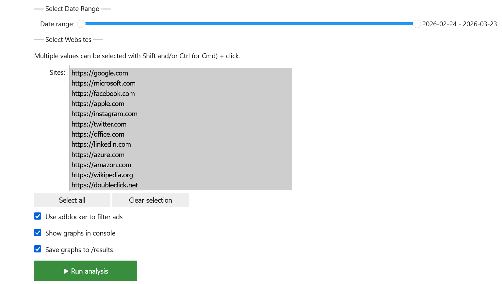
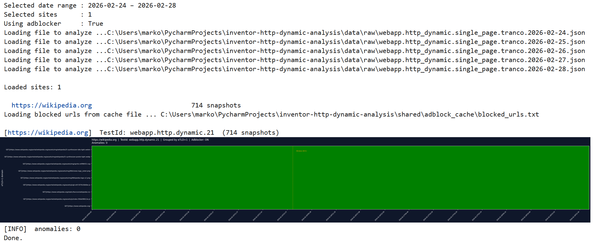
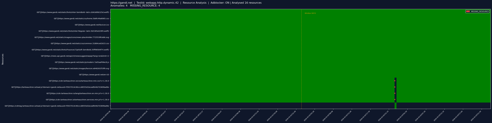
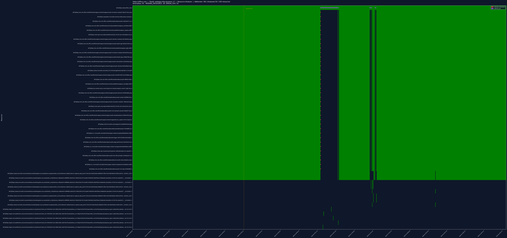
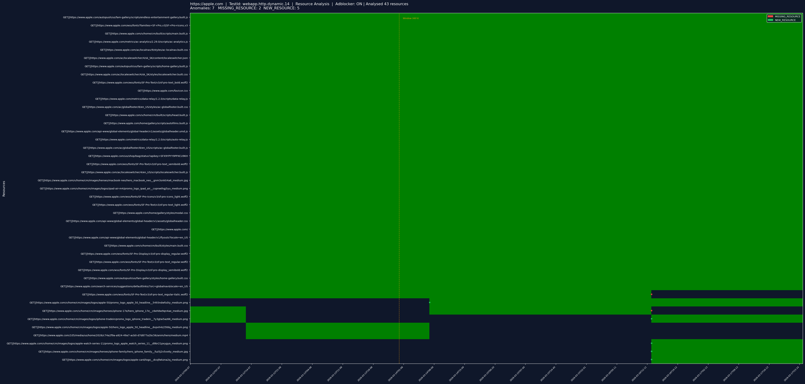

# Usage Manual — Single Resources Analysis Notebook


## Motivation


When a browser navigates to a web page, the first thing it receives is an HTML document. That document is not the page itself — it is a blueprint. It contains references to all the additional resources needed to render the page: stylesheets that control layout and appearance, JavaScript files that add interactivity, images, fonts, API calls that fetch dynamic content, and more. The browser then loads each of these resources.

Each of these external dependencies represents a point of failure. When one silently disappears — a script stops being served, an API endpoint starts returning errors — the impact can range from a broken layout to a completely non-functional service. Because these failures happen at the resource level rather than at the page level, they are invisible to HTTP availability monitors that only request a single endpoint and verify the returned response. 

The goal of this notebook is to make these hidden dependencies visible. By recording every resource loaded by a page across repeated monitoring snapshots and tracking each resource's presence and error rate over time, it becomes possible to detect the moment a previously reliable dependency stops appearing — or when an entirely new one shows up. Both events can be operationally significant: a disappearing resource may indicate an outage or a broken deployment, while a new resource appearing on a previously stable page may indicate an unexpected third-party introduction.

The sliding-window anomaly detection is designed to distinguish between resources that are a stable part of a page's infrastructure and those that appear only occasionally. Only resources with a consistently high presence rate over the history window are eligible for disappearance detection.


### Main Features
- Filters ad/tracker resources using the Ghostery adblocker (optional) to reduce noise from advertising domains.
- Detects four anomaly types using a sliding history window:
  - **MISSING_RESOURCE** — a resource that was reliably present suddenly stops appearing.
  - **NEW_RESOURCE** — a resource that was never seen before starts appearing consistently.
  - **ERROR_4XX** — HTTP 4xx error count exceeds the local historical median baseline.
  - **ERROR_5XX** — HTTP 5xx error count exceeds the local historical median baseline.
- Renders a heatmap for each monitored site with anomaly markers.
- Optionally saves the charts as PNG files to the `results/` directory.

---

## Input Data
For download instructions see [`data/README.md`](../../data/README.md).

---

## Running the Notebook

### Opening the Notebook

1. From the project root, launch Jupyter:
   ```bash
   jupyter notebook
   ```
2. Navigate to `analysis_single_resources/` and open `analysis_single_resources.ipynb`.

### Cell Execution Order

The notebook must be run **top to bottom** in order:

| Cell | Purpose                                                                                        |
|---|------------------------------------------------------------------------------------------------|
| 1 | Imports, global configuration (paths, window parameters, colours) and helper methods           |
| 2 | Loads `data_config.json` and discovers available data files                                    |
| 3 | Defines helper and analysis functions (`aggregate_page`, `detect_sliding_window`, `plot_page`) |
| 4 | Renders the interactive widget UI and registers button callbacks                               |


### Configuring Input Parameters

Constants for `Sliding Window Parameters` in **Cell 1**:

```python
WINDOW = 288  # history window size in snapshots (288 × 10 min = 48 h)
OUTAGE_CONSEC = 3  # consecutive missing snapshots to declare MISSING_RESOURCE (3 × 10 min = 30 min)
OUTAGE_MIN_PRES = 0.99  # minimum presence ratio in window to be eligible for MISSING_RESOURCE
NEW_RES_FUTURE_CONSEC = 6  # consecutive present snapshots to declare NEW_RESOURCE (6 × 10 min = 1 h)
MAX_RESOURCES_TO_ANALYZE = 100  # maximum unique resources per website to analyze 
```
Constants for `Visualisation Parameters` in **Cell 1**:

```python
RESOURCE_URL_HEAD_SIZE = 200 # Maximum number of characters preserved from the beginning of a URL.
RESOURCE_URL_TAIL_SIZE = 12  # Number of characters preserved from the end of a truncated URL
```

Edit these values before running the notebook if you want different sensitivity. 

If your monitoring interval differs from 10 minutes, scale all snapshot-count parameters accordingly. For example, with a 5-minute interval, `WINDOW = 288` still represents 24 hours.

---

## Using the Interactive UI

After running all four cells, an interactive control panel appears at the bottom of cell 4.



### Date Range Selection

A horizontal slider labelled **Date range** lets you select date range of monitored data. 
The range is inclusive on both ends selecting **2026-02-24** to **2026-02-25** covers all measurements from **2026-02-24 00:00** through **2026-02-25 23:59**.

### Site Selection

The **Sites** list shows all monitored URLs from the config. You can:
- Hold **Shift** and click to select a contiguous range.
- Hold **Ctrl / Cmd** and click to toggle individual entries.
- Click **Select all** to reselect everything.
- Click **Clear selection** to deselect everything.

### Adblocker Toggle

The **Use adblocker to filter ads** optional checkbox runs every resource URL through the Ghostery filter lists before aggregation. When enabled, known advertising and tracker domains are excluded from the heatmap. 

### Output Options

- **Show graphs in console** — renders each heatmap inline in the notebook output area.
- **Save graphs to /results** — writes a PNG file per site to `analysis_single_resources/results/`. File names follow the pattern `<test_id>.<host_slug>.png`.

### Running the Analysis

Click **Run analysis**. Output should appear below the controls for example:




A site is **skipped** if it has fewer snapshots than `WINDOW` (default: 288). You need at least 289 snapshots of data for a site to appear in the results.

---

## Interpreting the Results

### Heatmap

- Each row is uniquely identified by the composite key `<METHOD>||<URL of resource>`.
- Each column is one monitoring snapshot ordered chronologically left to right.
- **green cell** means the resource was present in that snapshot 
- **black cell** means it was absent. 
- vertical line marks the `WINDOW` boundary


A vertical line marks the initial `MOVING WINDOW` boundary. Everything to its left is historical context used to build the baseline. Anomaly detection only fires for columns to its right, as the window slides in time.
### Anomaly Markers

Coloured dots are overlaid on the heatmap cells where anomalies were detected:

| Colour | Anomaly | Meaning                                                                                 |
|---|---|-----------------------------------------------------------------------------------------|
| 🔴 Red | `MISSING_RESOURCE` | Resource was present in ≥ 99 % of the last 48 h, then gone for ≥ 30 consecutive minutes |
| 🟢 Green | `NEW_RESOURCE` | Resource was completely absent for 48 h, then appeared consistently for ≥ 1 h             |
| 🟠 Orange | `ERROR_4XX` | 4xx error count exceeded the 48-hour rolling median                                     |
| 🟣 Purple | `ERROR_5XX` | 5xx error count exceeded the 48-hour rolling median                                     |

All constants used for anomaly detections can be edited in `cell 1`
### Identifying Outages

Red markers highlight resources that suddenly disappear despite being consistently present beforehand.
In the example below, the four red anomaly markers show the point at which requests to these resources stopped appearing.



### Identifying Elevated Error Rates (ERROR_5XX)
The example below shows the analysis result for `https://office.com` 
The run detected 93 anomalies in total: 55x `ERROR_5XX` and 38x `MISSING_RESOURCE` in `2026-03-13 – 2026-03-19` date range.
The vast majority of these anomalies cluster tightly in time, visible as a wide black bar cutting across nearly all monitored resources at once, followed by a cluster of ERROR_5XX markers shortly after.
This timing lines up with a real, publicly confirmed incident on March 16, 2026, (https://www.neowin.net/news/microsoft-confirms-officecom-outage-as-exchange-online-mailbox-go-down/)





### Identifying New Resource
The example below shows the analysis result for `https://apple.com` 
The run detected 7 anomalies in total: 5x `NEW_RESOURCE` and 2x `MISSING_RESOURCE`
At the same point in time, two resources disappear (.png and .jpg) while four new resources appear (also .png and .jpg):

**Old resources that disappeared (`MISSING_RESOURCE`):**
- `GET||https://www.apple.com/v/home/cm/images/logos/apple-50/promo_logo_apple_50_headline__5493ndwfu0iy_medium.png`
- `GET||https://www.apple.com/v/home/cm/images/heroes/iphone-17e/hero_iphone_17e__c6eh8w9qn4ae_medium.jpg`

**New resources that replaced them (`NEW_RESOURCE`):**
- `GET||https://www.apple.com/v/home/cm/images/logos/apple-watch-series-11/promo_logo_apple_watch_series_11__d9br21pxygya_medium.png`
- `GET||https://www.apple.com/v/home/cm/images/heroes/iphone-family/hero_iphone_family__fuz5j2v5xx6y_medium.jpg`
- `GET||https://www.apple.com/v/home/cm/images/logos/apple-card/logo__dcojfwkzna2q_medium.png`
- `GET||https://www.apple.com/v/home/cm/images/logos/iphone-tradein/promo_logo_iphone_tradein__7y3gtai5az66_medium.png`

From looking at the resources it is obvious that the old images were swapped for new ones. So technically this shouldn't be flagged as an anomaly. This problem is described in section bellow and in the **Developer Manual**.





When reading the results, it is worth checking whether MISSING_RESOURCE and NEW_RESOURCE markers cluster at the same timestamp. It may indicate a routine content swap rather than two separate, unrelated anomalies.


## Resource Behaviour and Stability

The anomaly detection in this notebook operates on exact `<METHOD>||<URL>` keys. This means that when a resource changes its URL — even if the underlying asset is functionally identical — the detector treats it as one resource disappearing and an entirely new one appearing. This is the root cause of the false-positive patterns  (e.g. the `apple.com` image swap).

This behaviour is not specific to individual pages. An analysis of the full monitored dataset shows that URL-level changes occur routinely and fall into four distinct categories: **Query Parameter Change**, **Filename Change**, **Path Change**, and **Domain Change**. Each category reflects a different part of the URL that changes between snapshots.

For a detailed description of each change category, the stability analysis across all 62 monitored pages, see the **Developer Manual** of this notebook.

