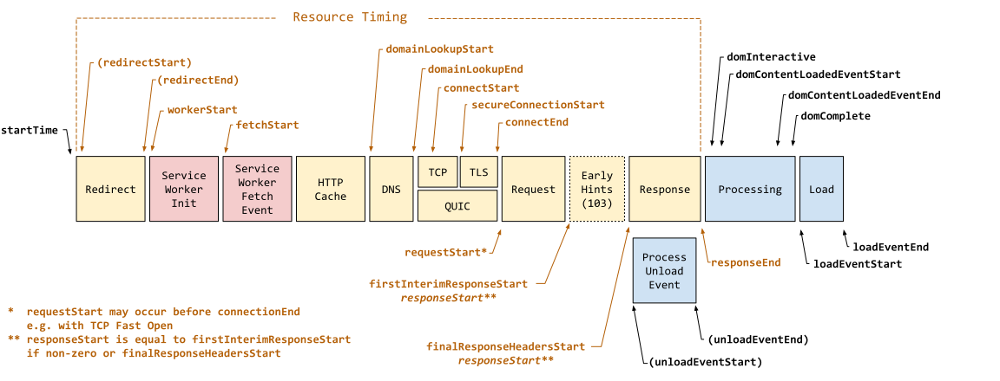
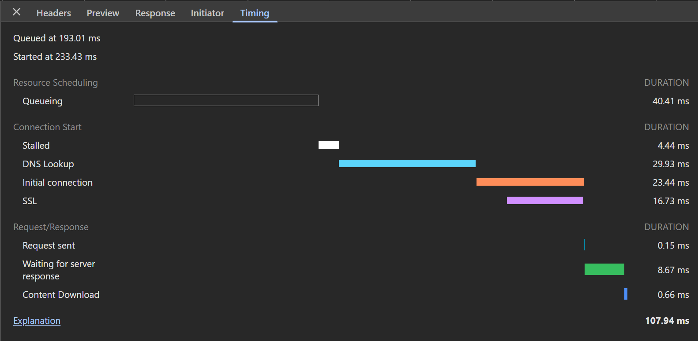
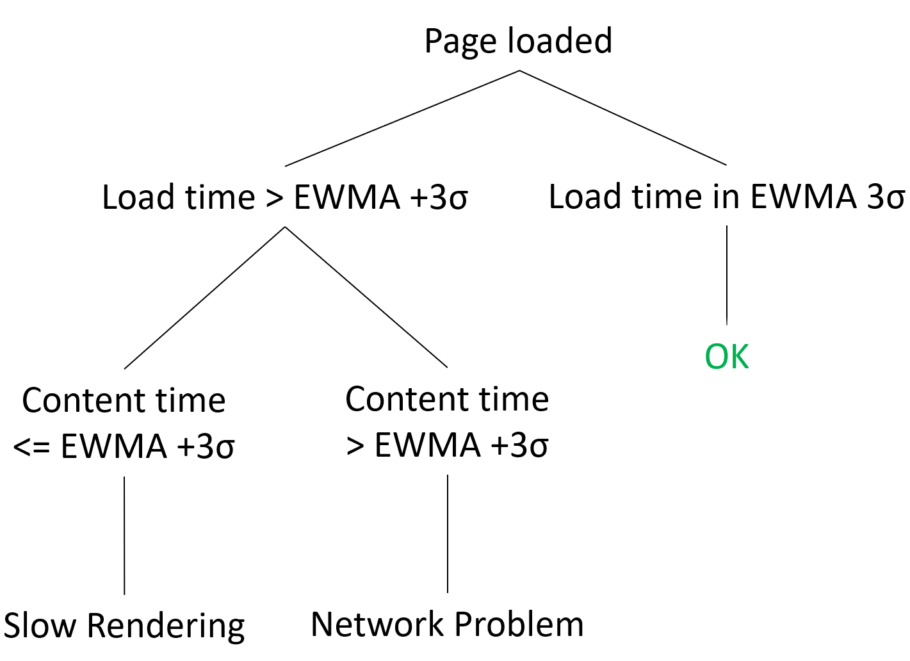

# Developer Manual — Time Series EWMA Analysis Notebook

# Section Menu

- [Developer Manual — Time Series EWMA Analysis Notebook](#developer-manual--time-series-ewma-analysis-notebook)
  - [Notebook Structure](#notebook-structure)
    - [Cell 1 — Imports and Configuration](#cell-1--imports-and-configuration)
    - [Cell 2 — Config Loading and File Discovery](#cell-2--config-loading-and-file-discovery)
    - [Cell 3 — Aggregation, Detection and Visualisation Functions](#cell-3--aggregation-detection-and-visualisation-functions)
    - [Cell 4 — Widget UI and Run Callback](#cell-4--widget-ui-and-run-callback)
    - [Activity Diagram](#activity-diagram)
- [Timing Data Inputs](#timing-data-inputs)
  - [The Load Event](#the-load-event)
  - [Resource Timing](#resource-timing)
  - [Derived Content Time from Resource Timing](#derived-content-time-from-resource-timing)
    - [Motivation](#motivation)
    - [The Problem: Mismatched Time Domains](#the-problem-mismatched-time-domains)
    - [Construction Procedure (Estimation)](#construction-procedure-estimation)
- [Diagnostic Methodology (Inspired by Fathom)](#diagnostic-methodology-inspired-by-fathom)
  - [The Core Concept](#the-core-concept)
  - [Diagnostic Decision Tree](#diagnostic-decision-tree)
- [Preprocessing](#preprocessing)
- [EWMA Control Chart](#ewma-control-chart)
  - [Standard Deviation and Control Limits](#standard-deviation-and-control-limits)
- [Data Model](#data-model)
- [Known Limitations](#known-limitations)
  - [Engineering / Scalability Limitations](#engineering--scalability-limitations)
  - [Statistical Model Limitations](#statistical-model-limitations)
  - [Measurement Limitation: Clock-Domain Approximation in Content Time](#measurement-limitation-clock-domain-approximation-in-content-time)
- [Bibliography](#bibliography)

## Notebook Structure

### Cell 1 — Imports and Configuration

Imports all third-party libraries and defines every global constant. 

Global path constants:

```python
ROOT = Path.cwd().parent
DATA_DIR = ROOT / "data" / "raw"
DATA_CONFIG = ROOT / "data" / "monitoring_config" / "test_id_to_target_host_mapper.json"
GRAPH_SAVE_FOLDER = './results'
GRAPH_RESULTS_DIR = Path(GRAPH_SAVE_FOLDER)
```

EWMA constants:
```python
ALPHA = 0.075      # smoothing factor (alpha in (0, 1])
SIGMA_MULT = 3     # control limit multiplier (UCL/LCL = ewma +/- SIGMA_MULT * sigma)
```

### Cell 2 — Config Loading and File Discovery

Discovers all matching JSON files in `data/raw/` and builds `available_dates` (sorted list of ISO date strings) used in UI date range picker.

Reads `test_id_to_target_host_mapper.json` and builds two lookup dictionaries:

```python
testid_to_host : dict[str, str]   # "webapp.http.dynamic.11" → "https://google.com"
host_to_testid : dict[str, str]   # "https://google.com" → "webapp.http.dynamic.11"
```
The user selects sites by human-readable URL (e.g. `https://google.com`) in the widget, but all internal operations use the `test_id` (e.g. `webapp.http.dynamic.11`). This is intentional. The `test_id` is the stable identifier as a result of using YAML monitoring configuration file.

---


### Cell 3 — Aggregation, Detection and Visualisation Functions

Contains the per-snapshot aggregation, the EWMA-based anomaly detector, the network-vs-rendering diagnosis logic, and the plotting entry point.

| Function | Purpose |
|---|---|
| `compute_content_time(load_time, waterfall_analysis)` | Derives a single snapshot's `Content Time` from its resource waterfall  |
| `add_content_time_column(g)` | Applies `compute_content_time()` row-wise to a per-`test_id` dataframe, adding a `content_time` column |
| `EWMAControlChart` | Incremental EWMA state object |
| `run_ewma(series)` | Runs an `EWMAControlChart` over a time-interpolated series|
| `diagnose_network_vs_rendering(load_over, content_over)` | Cross-references the `load_time` and `Content Time` over-threshold flags to classify anomalies as `Network Problem` or `Slow Rendering` |
| `diagnose_and_plot(g, target, test_id, ...)` | Orchestrates the full pipeline for one site and renders the diagnosis chart |


### Cell 4 — Widget UI and Run Callback

Instantiates `ipywidgets` controls, registers callbacks, and calls `display()`. The Run callback contains the main execution loop:

1. Resolve selected dates and files from widget state.
2. Load and parse raw data files, grouping snapshots by `target_host` using stable `test_id`.
3. For each site: call `diagnose_and_plot(g, target, test_id, ...)`.
4. `diagnose_and_plot()` internally:
   - adds the `content_time` (Content Time) column via `add_content_time_column()`,
   - time-interpolates both `load_time` and `content_time`,
   - runs `run_ewma()` independently on each series,
   - classifies anomalies via `diagnose_network_vs_rendering()`,
   - renders and optionally saves the chart.


# Timing Data Inputs

## The Load Event

The load event is fired when the whole page has loaded, including all dependent resources such as stylesheets, scripts (including async, deferred, and module scripts), iframes, and images, except those that are loaded lazily.

Collected dataset contains alias names for representing values of events:

* **`loadTime`**: Mapped from `loadEventEnd`. It represents the duration from `startTime` to `loadEventEnd`, where `startTime` is always `0`. In other words, `loadTime` is a relative span on a `0 → x` timeline.

All milestones in `PerformanceNavigationTiming` are relative to `PerformanceEntry.startTime`, which is defined as `0` — the very beginning of the navigation context (the start of the page fetch). The image below shows all timestamp properties defined in `PerformanceNavigationTiming`; `loadTime` corresponds to the span from `startTime` to `loadEventEnd`. It is also important to note that other, non-dependent resources may continue loading after this event fires.



## Resource Timing

Each resource that finished loading correctly carries a time of loading, calculated from the timestamps of the `Network.requestWillBeSent` and `Network.loadingFinished` events (CDP debugging API):

* **`start_time`** — taken directly from the `timestamp` field of the resource's `Network.requestWillBeSent` event.
* **`time`** (duration) — derived as the difference between the `timestamp` of `Network.loadingFinished` and `Network.requestWillBeSent`.

Both values live on the CDP session's own timestamp clock — a **different clock** than the one `PerformanceNavigationTiming.startTime`. As a consequence, `start_time` is a relative value only *within the waterfall itself*, and is not directly comparable to `loadTime` without further processing.

This `time` value is equivalent to the *Total Duration* of a resource in the Chrome DevTools Network timing panel, as shown below. It spans every phase from **Queueing** through **Content Download**. For more information see the [Chrome DevTools network timing reference](https://developer.chrome.com/docs/devtools/network/reference/?utm_source=devtools&utm_campaign=stable#timing-explanation).



## Derived Content Time from Resource Timing

### Motivation

When diagnosing why a page was slow, it is not enough to know that `load_time` increased — we also need to know whether the network itself was slow, or whether the browser was simply slow to process content it already had. This requires a second, independent metric that captures purely the network side of the page load: how long it took to download all the resources the page actually needed before it was considered "loaded".

This metric should include **only resources that finished downloading before the load event fired** — anything that continues downloading afterward (analytics pings, lazily-loaded images, etc.) is not part of what delayed the page from loading, and including it would contaminate the metric with unrelated noise.

This derived value is referred to throughout this manual as **`Content Time`** (implemented in Cell 3 as the `content_time` dataframe column produced by `add_content_time_column()`.

### The Problem: Mismatched Time Domains

Filtering "only what happened before load" requires comparing two values that come from different sources:

* `load_time`, anchored to `PerformanceNavigationTiming.startTime = 0`.
* each resource's `start_time`, anchored to the CDP session's own clock.

These two clocks are not natively expressed on the same axis, so the filtering condition "resource finished before load" cannot be evaluated directly by comparing the raw numbers.

### Construction Procedure (Estimation)

`Content Time` is not read directly from any single browser API — it is **derived in post-processing** by `compute_content_time()`, using an estimation that bridges the two clocks described above:

1. **Establish a reference zero-point (`t0`).** Among all entries in the waterfall, the resource with the lowest `start_time` is selected and its CDP timestamp is treated as `t0 = 0` on a new relative axis.
2. **Re-express every resource relative to `t0`.** For each resource `r`:
   $$rel\_end_r = (start\_time_r - t0) + time_r$$
   This produces a waterfall expressed entirely in "milliseconds since `t0`", directly comparable to Navigation Timing values.
3. **Apply the `loadTime` boundary.** `loadTime` is used as the cutoff on this same relative axis: only resources with `rel_end_r <= load_time` are kept.
4. **Aggregate.** `content_time = max(rel_end_r) − min(rel_start_r)` over the filtered set.

> This procedure is an **estimation**, not an exact measurement — it rests on treating `t0` as equivalent to `navigationStart`, which is not guaranteed by the data itself.

---

# Diagnostic Methodology 

## The Core Concept

This anomaly detection approach adapts the logic presented in the paper **Fathom**[1]. Fathom establishes that an anomaly in overall load time can be classified by cross-referencing it with a parallel anomaly evaluation of the network content download time.

## Diagnostic Decision Tree

By cross-analyzing concurrent anomalies across two independent metrics (`load_time` and `Content Time`), the system automatically deduces the underlying root cause, implemented in `diagnose_network_vs_rendering()`:

* **Network Problem** — Anomalies trigger on *both* `load_time` and `Content Time`. This points directly to network-layer issues.
* **Slow Rendering** — An anomaly triggers on `load_time` but `Content Time` remains entirely within its normal baseline. The network phase executed normally, yet the browser took an unusually long time to fire the Load event.

In the original **Fathom** paper, the diagnosis logic used a static baseline calculated by averaging the last 20 normal user sessions, with an anomaly threshold set at a 2σ boundary. This notebook instead applies an incremental EWMA method.



---

# Preprocessing

The dataset contains time gaps caused by incomplete test runs, as automated page-snapshot tests are scheduled to execute once every 10 minutes. To maintain a continuous timeline for the EWMA method, **time-based linear interpolation** is applied to bridge these missing periods before either series (`load_time` or `content_time`) is passed to `run_ewma()`.


---

# EWMA Control Chart

The method used for anomaly detection is **EWMA** (Exponentially Weighted Moving Average), a method commonly used for real-time anomaly detection in system monitoring[2]. It updates metrics incrementally without storing data history, implemented in `EWMAControlChart`.

At each time step $t$, the EWMA value ($\text{ewma}_t$) and the average of squares ($E[x^2]_t$) are updated as follows:

$$\text{ewma}_t = \alpha \cdot x_t + (1 - \alpha) \cdot \text{ewma}_{t-1}$$
$$E[x^2]_t = \alpha \cdot x_t^2 + (1 - \alpha) \cdot E[x^2]_{t-1}$$

Where $x_t$ is the current value, and $\alpha \in (0, 1]$ is the smoothing factor (`ALPHA`, set in Cell 1).

## Standard Deviation and Control Limits

The standard deviation $\sigma_t$ is calculated from the variance:

$$\sigma_t = \sqrt{E[x^2]_t - \text{ewma}_t^2}$$

The Upper (`UCL`) and Lower (`LCL`) Control Limits use a standard 3σ threshold (`SIGMA_MULT = 3`):

$$\text{UCL}_t = \text{ewma}_t + 3\sigma_t$$
$$\text{LCL}_t = \text{ewma}_t - 3\sigma_t$$

An anomaly is detected if the new value $x_t$ falls outside these limit ($x_t > \text{UCL}_t$), recorded by `run_ewma()` as the `over` / `under` boolean flag series.

---

# Data Model

### Per-`test_id` dataframe (`g`)

The input to `diagnose_and_plot()`. Indexed by timestamp, one row per snapshot for a given `test_id`.

```python
g: pd.DataFrame   # indexed by timestamp

# Required input columns:
{
    'load_time':          float,   # loadTime
    'waterfall_analysis':  list,    # list of resource dicts
}
```

### `waterfall_analysis` (per-snapshot resource list)

```python
waterfall_analysis: list[dict]

{
    'start_time': float,   # CDP Network.requestWillBeSent timestamp
    'time':       float,   # duration, Network.loadingFinished - Network.requestWillBeSent (ms)
}
```

### `content_time` column (derived — "Content Time")

Added in-place by `add_content_time_column(g)`, via `compute_content_time()` per row.

```python
g['content_time']: float   # ms; NaN if waterfall_analysis is missing/empty/invalid
```

### EWMA output series

Output of `run_ewma(series)`, all aligned to the same (interpolated) index as the input series:

```python
ewma:  pd.Series[float]   # EWMA baseline value at each timestamp
ucl:   pd.Series[float]   # Upper Control Limit (ewma + 3·stddev)
lcl:   pd.Series[float]   # Lower Control Limit (ewma - 3·stddev)
over:  pd.Series[bool]    # True where value > ucl
under: pd.Series[bool]    # True where value < lcl
```

`run_ewma()` is called independently for `load_time` and for `content_time` — there are therefore two complete sets of these five series per site.

### Diagnosis output

Output of `diagnose_network_vs_rendering(load_over, content_over)`:

```python
network_idx: pd.DatetimeIndex   # timestamps where BOTH load_time and Content Time are anomalous
slow_idx:    pd.DatetimeIndex   # timestamps where load_time is anomalous but Content Time is not
```

### `anomaly_counts`

Returned by `diagnose_and_plot()` alongside the (mutated) dataframe `g` and the saved chart's `out_path`:

```python
anomaly_counts: dict[str, int]

{
    'network':        len(network_idx),
    'slow_rendering':  len(slow_idx),
}
```

---

# Known Limitations

**Performance on large datasets.** All snapshots for all selected sites are loaded into memory before aggregation. Selecting multiple websites and wide date range can result to a high RAM consumption and long analysis execution.

**Single-threaded file loading.** The `on_run` loop loads files sequentially. On large datasets this is the dominant bottleneck (~90s for 27 files × 250 MB). 

---

# Bibliography


[1] Mohan Dhawan, Justin Samuel, Renata Teixeira, Christian Kreibich, Mark Allman, Nicholas Weaver, and Vern Paxson. 2012. Fathom: a browser-based network measurement platform. In Proceedings of the 2012 Internet Measurement Conference (IMC '12). Association for Computing Machinery, New York, NY, USA, 73–86. https://doi.org/10.1145/2398776.2398786

[2] JINKA, Preetam a SCHWARTZ, Baron. *Anomaly Detection for Monitoring.* O'Reilly Media, 2015. ISBN 978-1-491-93578-1.