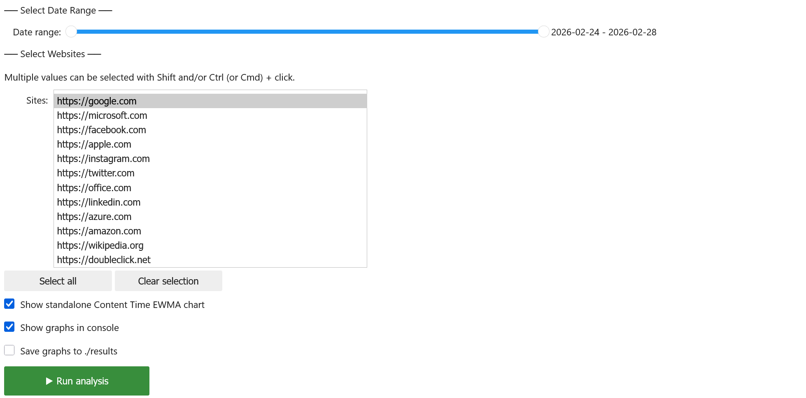
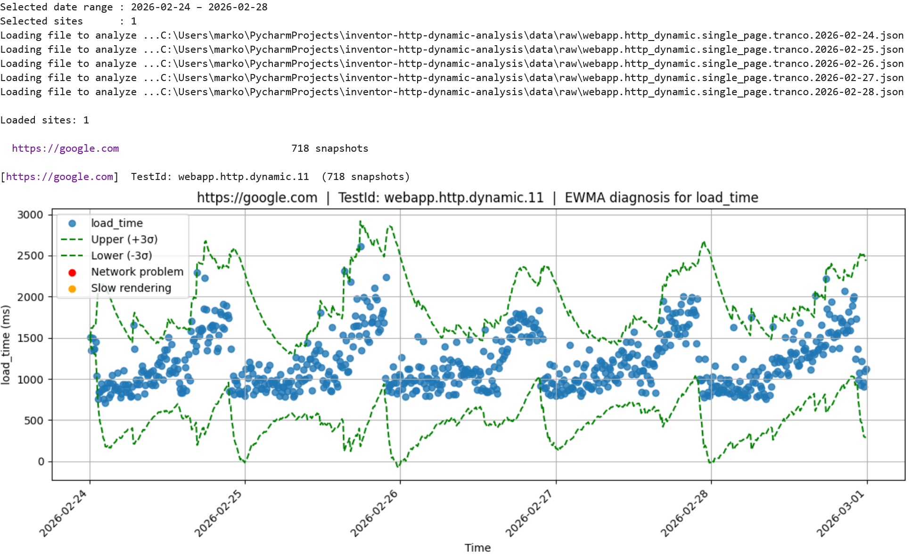
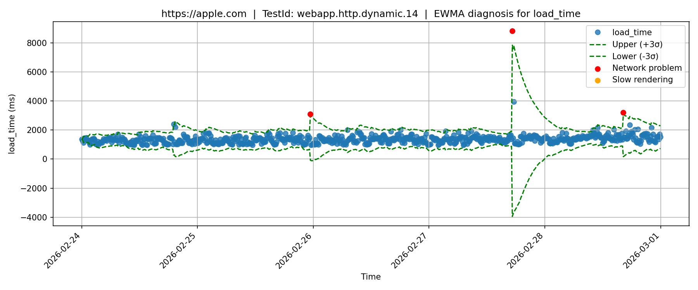
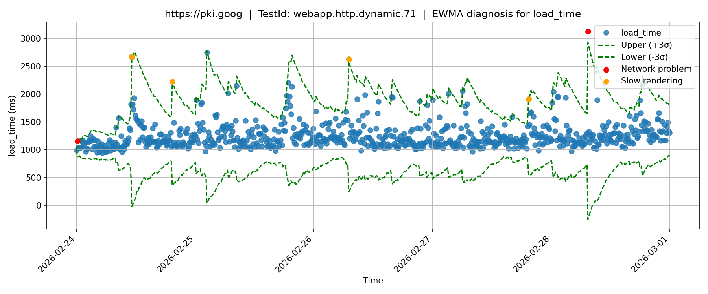
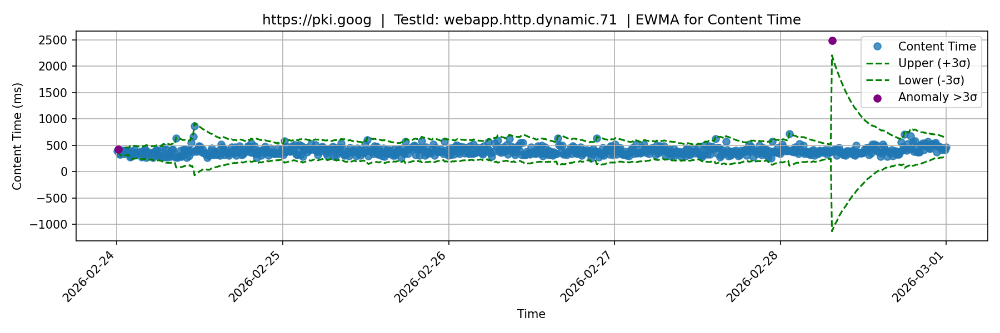

# Usage Manual — Time Series EWMA Notebook


## Motivation

The `load` event tells when the whole page has loaded. Using statistical method to detect anomalies (load time too high) can show you only when the page loaded poorly. The cause could be the network, or it could be the browser itself being slow to process content from resources that already has.

This notebook adds a second, independent signal, `Content Time` (an estimate of how long the network spent downloading what the page needed and tracks anomalies on both metrics to tell the two cases apart: a **Network Problem** when both metrics are classified as anomaly together, or **Slow Rendering** when only `load_time` is classified as anomaly and content time not. 


### Main Features
- Runs an incremental EWMA control chart (±3σ control limits) independently on both metrics `load` and `Content Time`.
- Cross-references anomalies on both metrics using decision tree to classify each `load` anomaly as:
  - **Network Problem** — anomaly on both `load` and `Content Time`.
  - **Slow Rendering** — anomaly on `load` only, with `Content Time` remaining within its normal baseline.
- Renders an EWMA control chart for `load` with anomalies overlaid as coloured markers.
- Optionally renders a standalone EWMA control chart for `Content Time`.
- Optionally saves the charts as PNG files to the `results/` directory.

---

## Input Data
For download instructions see [`data/README.md`](../../data/README.md).

---

## Running the Notebook

### Opening the Notebook

1. From the project root, launch Jupyter:
   ```bash
   jupyter notebook
   ```
2. Navigate to `analysis_time_series_ewma/` and open `analysis_time_series_ewma.ipynb`.

### Cell Execution Order

The notebook must be run **top to bottom** in order:

| Cell | Purpose                                                                                          |
|---|----------------------------------------------------------------------------------------------------|
| 1 | Imports, global configuration (paths, EWMA parameters) and helper methods                          |
| 2 | Loads `data_config.json` and discovers available data files                                        |
| 3 | Defines `Content Time` computation, the EWMA control chart, the diagnosis logic and the plotting function (`diagnose_and_plot`) |
| 4 | Renders the interactive widget UI and registers button callbacks                                   |

### Configuring Input Parameters

All constants are in **Cell 1**, clearly marked in the `# EWMA control chart parameters` block:

```python
ALPHA      = 0.075  # smoothing factor (alpha in (0, 1])
SIGMA_MULT = 3      # control limit multiplier (UCL/LCL = ewma ± SIGMA_MULT * sigma)
```

Edit these values before running the notebook if you want different sensitivity. A lower `ALPHA` makes the EWMA baseline react more slowly to recent values (smoother, fewer false positives, slower to pick up a genuine shift); a higher `ALPHA` makes it track recent values more closely. Lowering `SIGMA_MULT` makes the control limits narrower and the detector more sensitive.

---

## Using the Interactive UI

After running all four cells, an interactive control panel appears at the bottom of cell 4.



### Date Range Selection

A horizontal slider labelled **Date range** lets you select date range of monitored data.
The range is inclusive on both ends — selecting **2026-02-24** to **2026-02-25** covers all measurements from **2026-02-24 00:00** through **2026-02-25 23:59**.

### Site Selection

The **Sites** list shows all monitored URLs from the config. You can:
- Hold **Shift** and click to select a contiguous range.
- Hold **Ctrl / Cmd** and click to toggle individual entries.
- Click **Select all** to reselect everything.
- Click **Clear selection** to deselect everything.

### Content Time Chart Toggle

The **Show standalone Content Time EWMA chart** checkbox is off by default. When enabled, an additional EWMA control chart for `Content Time` is rendered for each selected site, alongside the main `load_time` diagnosis chart. This chart has no anomaly markers of its own — it is provided purely as supporting context for the classification already shown on the main chart.

### Output Options

- **Show graphs in console** — renders each chart inline in the notebook output area.
- **Save graphs to /results** — writes a PNG file per chart to `analysis_time_series_ewma/results/`. File names follow the pattern:
  - `<timestamp>.<host_slug>.<test_id>_load_time_diagnosis.png` for diagnosis of two possible anomalies
  - `<timestamp>.<host_slug>.<test_id>_content_time_ewma.png` for `Content time` anomalies.

### Running the Analysis

Click **Run analysis**. Output should appear below the controls, for example:



Every selected site with at least one snapshot in the selected date range is analysed — there is no minimum snapshot count to appear in the results. Sites with very few snapshots will simply produce a chart with a short, mostly flat EWMA baseline and few or no anomalies, since the control chart has had little history to learn from.

---

## Interpreting the Results

### Main Chart — `load` Diagnosis

- The horizontal axis is time, ordered chronologically left to right.
- Each point is one monitoring snapshot's `load` time (after time-based interpolation).
- The dashed green lines are the EWMA control limits (**Upper (+3σ)** and **Lower (-3σ)** by default, controlled by `SIGMA_MULT`).

### Anomaly Markers

| Colour | Anomaly | Meaning |
|---|---|---|
| 🔴 Red | `Network problem` | `load` AND `Content Time` are both anomalous — the network/download phase is implicated. |
| 🟠 Orange | `Slow rendering` | `load` is anomalous but `Content Time` remained within its normal baseline — the network phase was normal, the browser took unusually long to fire the `load` event. |

All constants used for anomaly detection can be edited in `cell 1`.

### Optional Chart — `Content Time` EWMA

When **Show standalone Content Time EWMA chart** is enabled, a second chart is rendered showing the `Content Time` series, its own EWMA baseline, and its own ±3σ control limits. Purple markers indicate points where `Content Time` itself crossed its control limits. This chart does not by itself indicate a Network Problem — refer to the main chart's red/orange markers for the combined diagnosis.

### Identifying a Network Problem

Red markers highlight snapshots where both metrics moved outside their normal baseline together — the network/download phase of resources took unusually long, and that delay is reflected in the overall `load_time`.



### Identifying Slow Rendering

Orange markers highlight snapshots where `load` spiked but the network/download phase of resources (`Content Time`) stayed within its normal range. Pointing to a delay in browser-side processing rather than the network.



### Optional Chart `Content Time` EWMA for clarification of Slow Rendering example above
Purple markers highlight snapshots where `Content time` spiked but as we can see content time was relatively stable in time no anomalies was detected. Meaning the previous chart showing Slow Rendering detected anomaly in date range 02.24 - 02.28 but content time was behaving usual meaning the load time couldn't be caused by slow network.


### Optional Chart — `Content Time` EWMA

When **Show standalone Content Time EWMA chart** is enabled, a second chart is rendered showing the `Content Time` series, its own EWMA baseline, and its own ±3σ control limits. Purple markers indicate points where `Content Time` itself crossed its control limits. This chart does not by itself indicate a Network Problem — refer to the main chart's red/orange markers for the combined diagnosis.

### Identifying a Network Problem

Red markers highlight snapshots where both metrics moved outside their normal baseline together — the network/download phase of resources took unusually long, and that delay is reflected in the overall `load_time`.


### Identifying Slow Rendering

Orange markers highlight snapshots where `load_time` spiked but the network/download phase of resources (`Content Time`) stayed within its normal range, pointing to a delay in browser-side processing rather than the network.


### Optional Chart — Confirming the Slow Rendering Example Above

The standalone `Content Time` chart for the same site does show two purple markers, but at different points in time than the Slow Rendering anomalies example on the main chart. Since `Content Time` was not anomalous at the same timestamps as the `load_time` spikes resulting to classification of anomaly `load_time` spikes as Slow Rendering and not Network Problem.




### A Note on `Content Time` Reliability

`Content Time` is an **estimation**, not a direct measurement. It depends on aligning two clocks that are not guaranteed to coincide — a systematic mismatch (e.g. caused by redirects or service workers on a given site) would bias every `Content Time` value for that site.


